<div align="center">

[](docs/header.jpg)
[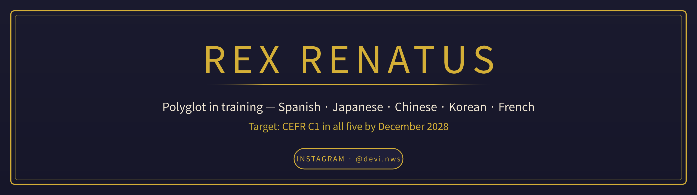](docs/hero-banner.png)

</div>

# Language-Learning-V2

A **structured A1→native language course** for **Spanish, French, Japanese, Chinese (Mandarin),
and Korean** — study units in order, like a textbook, with native-speaker audio throughout.

The **Progressive Course** is the flagship: study **units in order**, each one a CEFR can-do
lesson built from **eight card types and zero multiple-choice** — every card tests *active*
knowledge (production, listening, dictation, mediation, writing, reading). The 10 type-decks further down
(120,890 cards) are now the **content pool** the course is assembled from — still downloadable
as reference/drill material, but no longer the headline study path.

> Previous version: [DEPRECATED-Language-Learning-Journey](https://github.com/RexRenatus/DEPRECATED-Language-Learning-Journey) (archived).

---

## 🎓 Progressive Course — the flagship

A **structured A1→native course**, not just flashcards. Study **units in order**. Each course opens
with **4 from-zero foundation units** — writing system & pronunciation, numbers, colours, and
days/time & survival phrases — where letter/sound cards show **IPA** and play **phoneme-forced
audio** (true Castilian/Parisian/Mandarin-tone/Seoul values, not a TTS guess). After that, each
unit is a real lesson anchored to a **CEFR can-do** goal and runs the same core loop:

> **0 Dialogue** (comprehensible input · audio) → **1 Vocab** (type the word · listen) →
> **2 Grammar** (type the form · cloze) → **3 Transform** (apply the rule) → **4 Dictation** (hear → type)

From **B1** each unit adds three **CEFR-2020 skill strands** (graded against the exam tasks —
DELE *mediación*, TOPIK II 쓰기, DELF/DALF production):

> **5 Mediation** (relay/summarise a source for a third party) → **6 Composition** (genre-scaffolded
> guided writing → model + self-check) → **7 Reading** (authentic-style passage → literal + inferential questions)

**Eight card types, zero multiple-choice** — every card tests **active knowledge** (production,
listening, dictation, mediation, free writing, reading comprehension), with **native-speaker neural audio** (Google) throughout.
Grammar is **sequenced like a textbook** (Spanish: ser → present → past tenses → **subjunctive hub**;
Japanese: です → polite forms → **て-form hub** → conditionals); vocabulary is **grouped by theme**
per unit, with the rest of the ~30k inventory riding along as a 3-layer, level-gated
*Vocab-Expansion* track. **Chinese & Japanese** add a **character-recognition** card (see the
hanzi/kanji → recall reading + meaning) — the essential reading direction for logographic scripts.
Every card is **numbered in course order**, so with Anki's *New card gather order = Ascending
position* the whole course surfaces in exact A1→native sequence. Open the **Unit 00** card for
how-to-study + recommended Anki settings.

[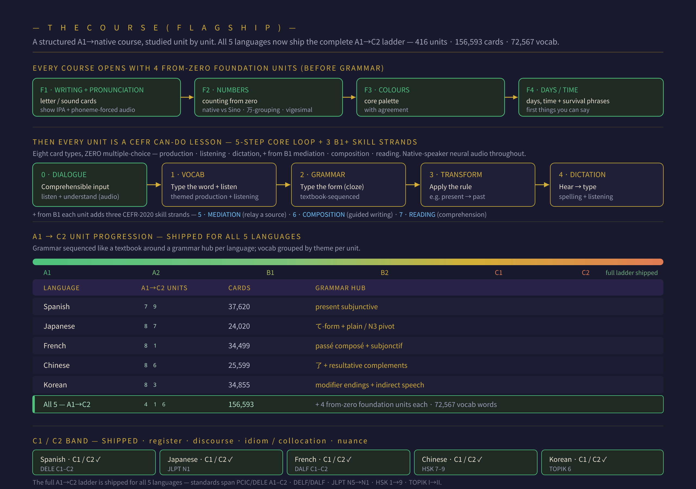](docs/course-path.png)

<sub>Click to open full-size and zoom in.</sub>

| Course | Units | Range | Cards | Vocab words | Download |
|---|---|------:|------:|------:|---|
| **Spanish** | 79 | A1→C2 | 38,111 | 17,774 | [⬇ Course-Spanish.apkg](https://storage.googleapis.com/aol-language-decks-v2/v2/course/Course-Spanish.apkg) (176 MB) |
| **Japanese** | 87 | A1→C2 | 33,360 | 10,854 | [⬇ Course-Japanese.apkg](https://storage.googleapis.com/aol-language-decks-v2/v2/course/Course-Japanese.apkg) (101 MB) |
| **French** | 81 | A1→C2 | 34,883 | 16,134 | [⬇ Course-French.apkg](https://storage.googleapis.com/aol-language-decks-v2/v2/course/Course-French.apkg) (132 MB) |
| **Chinese** | 86 | A1→C2 | 40,477 | 11,562 | [⬇ Course-Chinese.apkg](https://storage.googleapis.com/aol-language-decks-v2/v2/course/Course-Chinese.apkg) (120 MB) |
| **Korean** | 83 | A1→C2 | 36,616 | 16,243 | [⬇ Course-Korean.apkg](https://storage.googleapis.com/aol-language-decks-v2/v2/course/Course-Korean.apkg) (149 MB) |

_All five languages now ship a complete **A1→C2 course** — the full CEFR ladder: **416 units ·
183,447 cards · 72,567 vocab words**, native-speaker neural audio throughout. Every course opens with
**4 from-zero foundation units** (writing system & pronunciation → numbers → colours → days/time &
survival) — the Chinese and Japanese onsets now teach the **full pinyin (416 syllables) and kana
gojūon (107) charts** as hear-the-sound → type-the-syllable cards (neutral tone, IPA + example word) —
climbs through A1→B2 grammar to a **C1/C2 band** (register, discourse, idiom/collocation, nuance), and
from B1 adds **mediation, composition, and reading** strands aligned to the exam tasks. Targeted
reference-drill decks round out the hardest systems: **measure words** (zh/ja/ko), **verb conjugation**
(fr/ko/ja), Korean **speech levels** (반말/해요체/하십시오체), **Sino-root word families** (ko/zh), and
Korean **받침 pronunciation sandhi**._
SHA-256:
[`SHA256SUMS`](https://storage.googleapis.com/aol-language-decks-v2/v2/course/SHA256SUMS)._

### 🗺️ The full A1→C2 ladder — shipped

**All five languages now ship the complete A1→C2 course.** Syllabi are grounded in each language's
national standard across the whole range (PCIC/DELE A1–C2 · DELF/DALF · JLPT N5→N1 · HSK 1→9 ·
TOPIK I→II), validated for CEFR ordering and grammar-point binding, with native-speaker audio
throughout. C1/C2 was authored with the model shift in mind — at the upper levels the drills target
register, discourse markers, set collocations, idioms, and nuance pairs rather than new conjugations.

| Language | Shipped | Standard | C1/C2 focus |
|---|---|---|---|
| **Spanish** | 79 units · A1→C2 | PCIC/DELE A1–C2 | refranes, valoración subjunctive, academic/literary register |
| **Japanese** | 87 units · A1→C2 | JLPT N5→N1 + post-N1 | keigo mastery, 四字熟語, 評論/学術 register |
| **French** | 81 units · A1→C2 | DELF/DALF A1–C2 | subjonctif passé, registre soutenu, proverbes, mise en relief |
| **Chinese** | 86 units · A1→C2 | HSK 1→9 | 成语, 书面语, 修辞, classical 文言 remnants |
| **Korean** | 83 units · A1→C2 | TOPIK I→II + 고급 | 한자성어, 문어체, 격식체, 수사 |

---

## ✍️ Writing Drills — stroke order (Chinese · Japanese · Korean)

**New — learn to *write*, not just read.** Two standalone Anki decks bring **interactive
stroke-order tracing** to the iPad: write each character with your finger or Apple Pencil in
**AnkiMobile** and get **graded stroke-by-stroke** (powered by Hanzi Writer, fully offline) — plus
**five spaced-repetition PDF workbooks** to write by hand in **GoodNotes** (田字格 / genkō grids,
12 pt, fully vector so they stay crisp when you zoom). Every card carries **pinyin (zh) / reading +
rōmaji (ja)**, an **English definition**, and a **native-voice audio** clip.

[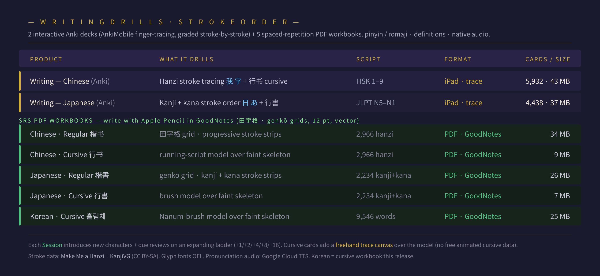](docs/writing-catalog.png)

<sub>Click to open full-size and zoom in.</sub>

| Product | Script | Coverage | Format | Download |
|---|---|---|---|---|
| **Writing — Chinese** | hanzi 楷书 + 行书 | HSK 1–9 · 2,966 hanzi · 5,932 cards | Anki · iPad trace | [⬇ Writing-Chinese.apkg](https://storage.googleapis.com/aol-language-decks-v2/v2/writing/Writing-Chinese.apkg) (43 MB) |
| **Writing — Japanese** | kanji + kana 楷書 + 行書 | JLPT N5–N1 + kana · 2,234 · 4,438 cards | Anki · iPad trace | [⬇ Writing-Japanese.apkg](https://storage.googleapis.com/aol-language-decks-v2/v2/writing/Writing-Japanese.apkg) (37 MB) |
| **Chinese workbook · Regular** | 楷书 · 田字格 | 2,966 hanzi · SRS | PDF · GoodNotes | [⬇ Writing-Chinese-Regular.pdf](https://storage.googleapis.com/aol-language-decks-v2/v2/writing/workbooks/Writing-Chinese-Regular.pdf) (33 MB) |
| **Chinese workbook · Cursive** | 行书 | 2,966 hanzi · SRS | PDF · GoodNotes | [⬇ Writing-Chinese-Cursive.pdf](https://storage.googleapis.com/aol-language-decks-v2/v2/writing/workbooks/Writing-Chinese-Cursive.pdf) (8 MB) |
| **Japanese workbook · Regular** | 楷書 · genkō | 2,234 · SRS | PDF · GoodNotes | [⬇ Writing-Japanese-Regular.pdf](https://storage.googleapis.com/aol-language-decks-v2/v2/writing/workbooks/Writing-Japanese-Regular.pdf) (26 MB) |
| **Japanese workbook · Cursive** | 行書 | 2,234 · SRS | PDF · GoodNotes | [⬇ Writing-Japanese-Cursive.pdf](https://storage.googleapis.com/aol-language-decks-v2/v2/writing/workbooks/Writing-Japanese-Cursive.pdf) (7 MB) |
| **Korean workbook · Cursive** | 흘림체 | TOPIK · 9,546 words · SRS | PDF · GoodNotes | [⬇ Writing-Korean-Cursive.pdf](https://storage.googleapis.com/aol-language-decks-v2/v2/writing/workbooks/Writing-Korean-Cursive.pdf) (25 MB) |

SHA-256: [`SHA256SUMS`](https://storage.googleapis.com/aol-language-decks-v2/v2/writing/SHA256SUMS).

**How it works.** *Decks* — import the `.apkg` into **AnkiMobile** (iPad): the front shows the reading
+ meaning (and plays the audio), you trace the character, and each stroke is graded with a hint after
two misses; the back reveals a numbered stroke-order diagram. *Workbooks* — open the PDF in **GoodNotes**
and write in the squared grids; each is ordered into **Sessions** that introduce a few new characters
and re-present earlier ones at expanding intervals (+1/+2/+4/+8/+16 sessions).

> **On cursive.** No freely-licensed *animated* cursive dataset exists, so cursive isn't stroke-graded.
> Instead each cursive **deck** card gives a **freehand trace canvas** — the cursive model glyph (zh 行书
> · ja 行書 · ko 흘림체, OFL fonts) shows faint and you trace it with finger / Apple Pencil, with a
> **▶ Stroke order** button that animates the underlying regular skeleton; the **workbooks** print the
> model over a faint skeleton to copy. A handful (~30) of rare Japanese kanji ship cursive-only.

**Sources.** Stroke order from [Make Me a Hanzi](https://github.com/skishore/makemeahanzi) (zh) and
[KanjiVG](http://kanjivg.tagaini.net) (ja, CC BY-SA 3.0) via [Hanzi Writer](https://hanziwriter.org);
kanji glosses from kanjidic; pronunciation audio from Google Cloud TTS; practice fonts under the SIL
Open Font License.

---

## The content pool (10 type-decks)

The course is assembled from a pool of **120,890 cards across 10 type-decks**. They remain
downloadable on their own as **reference / drill** material — handy for targeted practice — but
the course above is the recommended study path. The pool spans **Vocab-MCQ Recognition + Recall**
(68,248 cards · full A1–B2 · **all 5 languages incl. French**) plus Function-Words,
Grammar-Patterns, Sentence-Mining, Conjugation, Counters, Synonyms, Register, and Numbers. Every
cloze-MCQ card has a `— W H Y —` reasoning block on the back generated by Gemini.

---

## What's new

[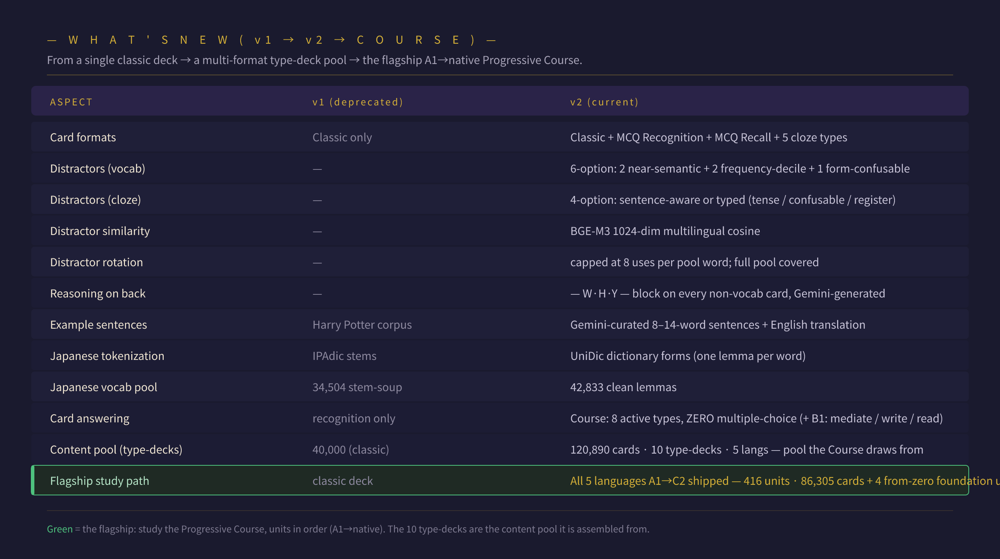](docs/whats-new.png)

<sub>Click to open full-size and zoom in.</sub>

For the Japanese rebuild story, see [`docs/ja-unidic-rebuild.md`](docs/ja-unidic-rebuild.md).

---

## Deck catalog (content pool)

[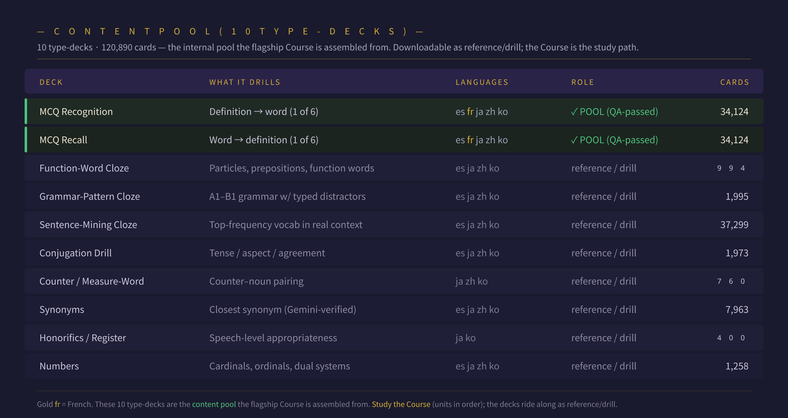](docs/deck-catalog.png)

<sub>Click the catalog to open it full-size and zoom in. These 10 type-decks are the **content pool** the course is built from; download them for reference/drill, or study the [course](#-progressive-course--the-flagship) above.</sub>

Per-language pages: **[Spanish](es/) · [French](fr/) · [Japanese](ja/) · [Chinese](zh/) · [Korean](ko/)**

See [`docs/cloze-mcq-design.md`](docs/cloze-mcq-design.md) for the cloze-MCQ card format, including the reasoning block.

---

## Card previews

Every interactive card uses the Imperial Golden Age theme — gold accents on dark navy, with a structured back: green ✓ ANSWER banner, **CORE LOGIC** section explaining the rule, **MEMORY AID** section with deck-specific framing (pattern formula / etymology / paradigm hint / visual analogy / nuance distinction / social-context cue), and footer metadata pills.

<details>
<summary><b>🔎 Click to see real card previews (front + back) per deck type</b></summary>

### Vocabulary decks

| Deck | Preview |
|------|---------|
| Vocab MCQ Recognition | [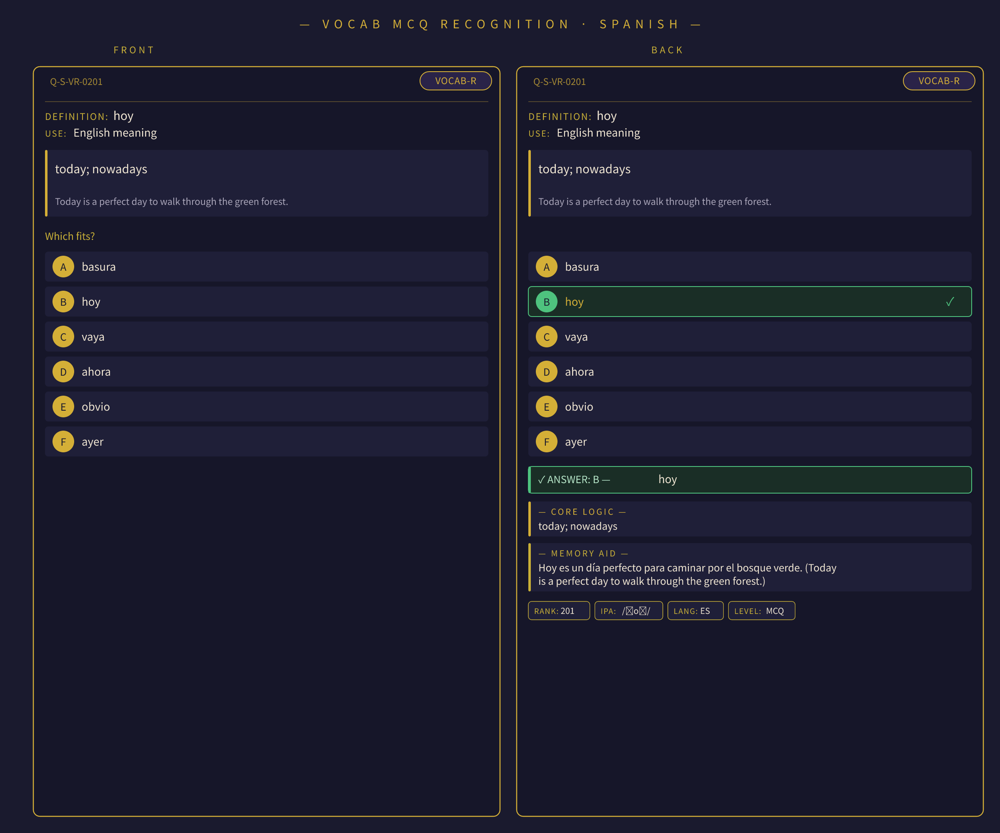](docs/previews/vocab-recognition-spanish.png) |
| Vocab MCQ Recall      | [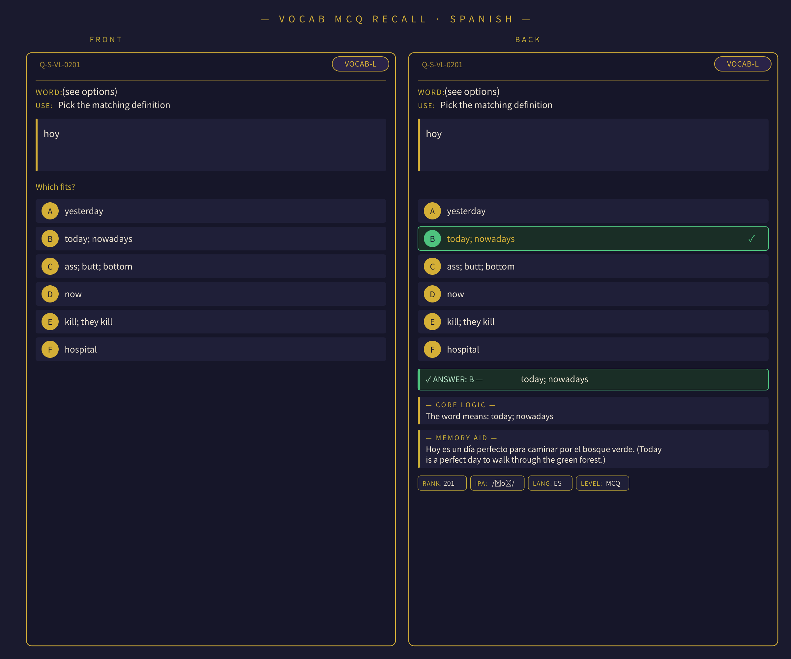](docs/previews/vocab-recall-spanish.png) |

### Cloze-MCQ decks (with `— W H Y —` reasoning)

| Deck | Preview |
|------|---------|
| Function-Word Cloze     | [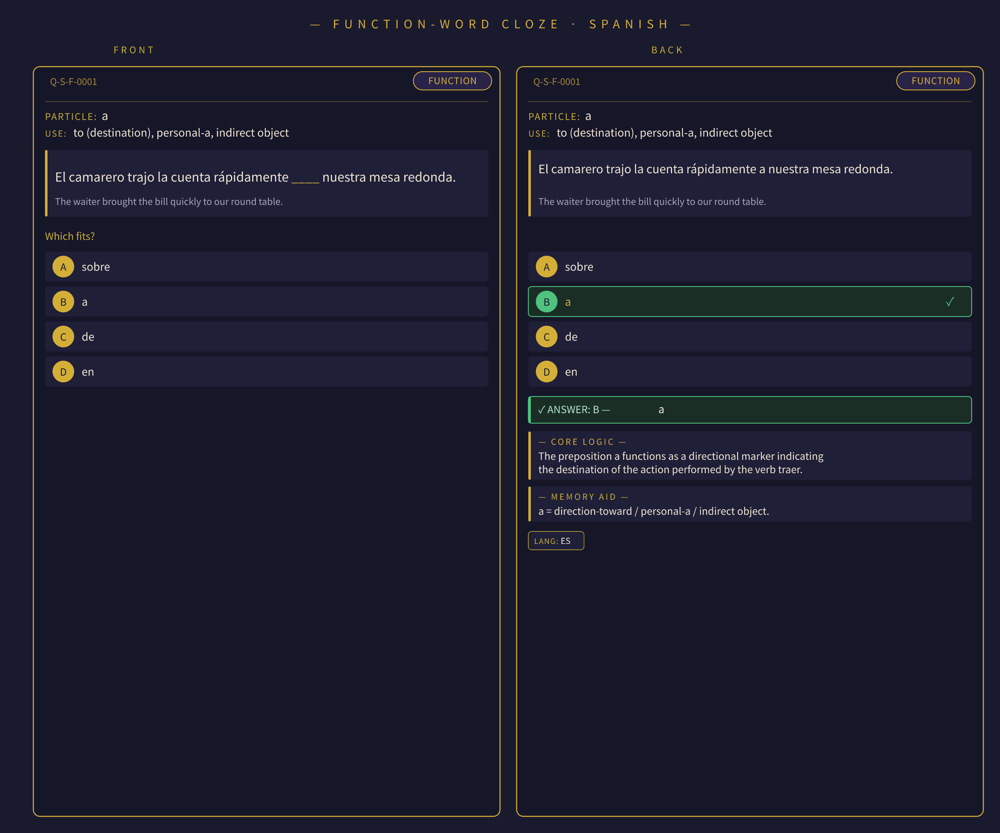](docs/previews/function-spanish.png) |
| Grammar-Pattern Cloze   | [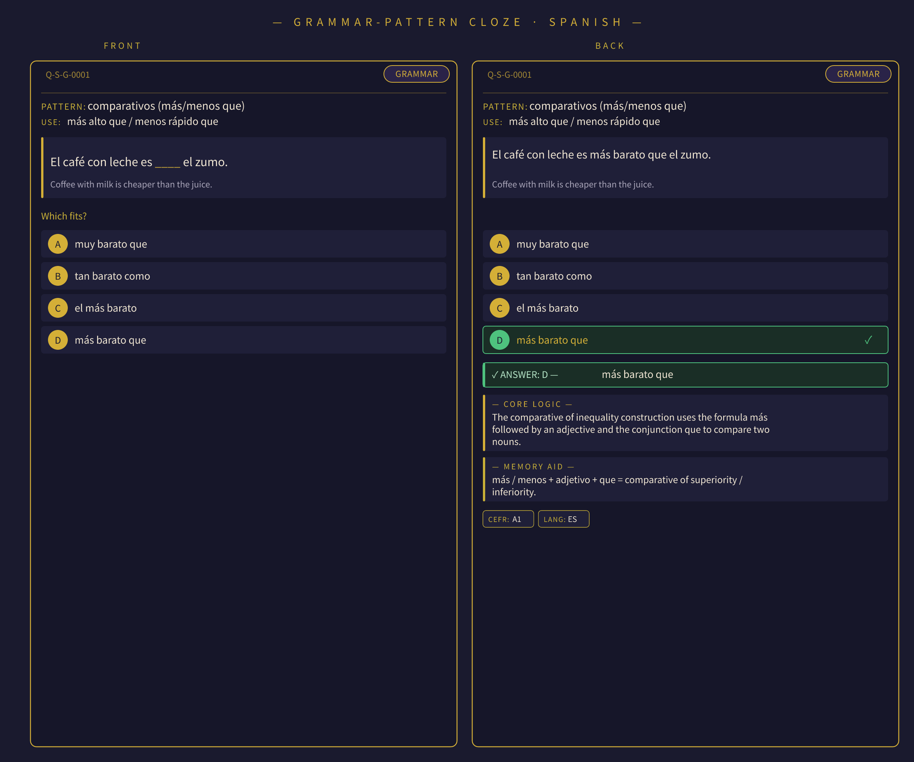](docs/previews/grammar-spanish.png) |
| Sentence-Mining Cloze   | [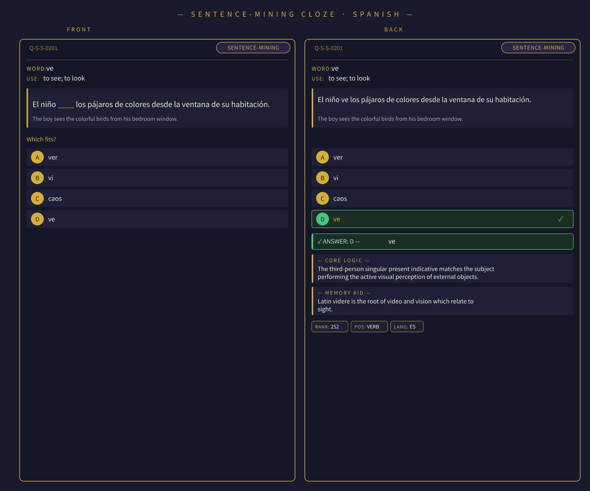](docs/previews/sentence-mining-spanish.png) |
| Conjugation Drill       | [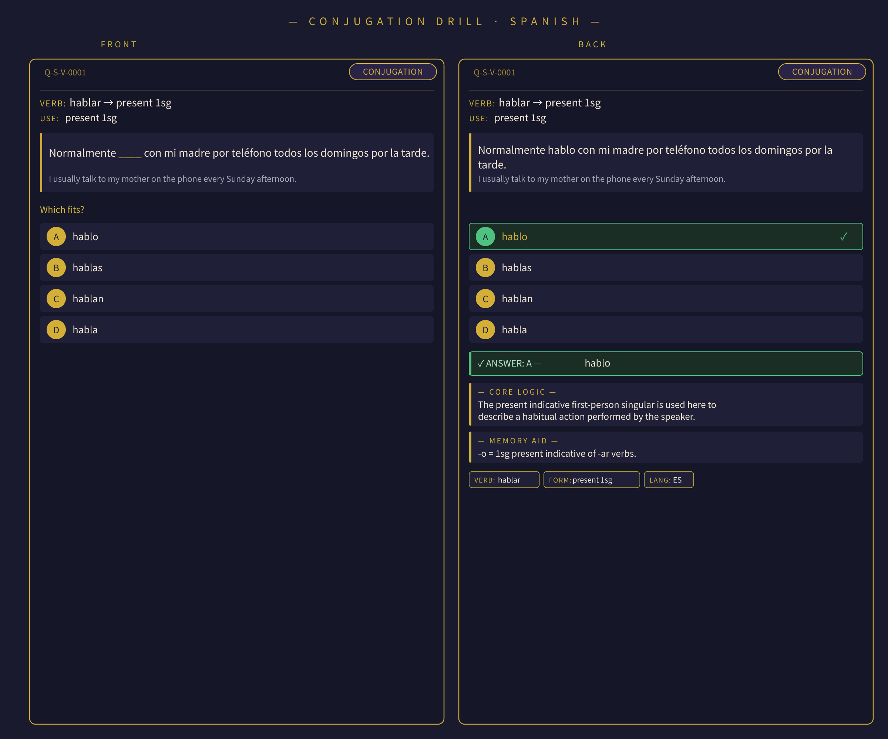](docs/previews/conjugation-spanish.png) |
| Counter / Measure-Word  | [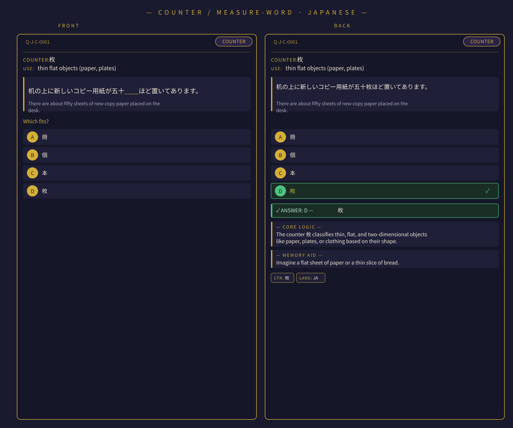](docs/previews/counter-japanese.png) |
| Synonyms                | [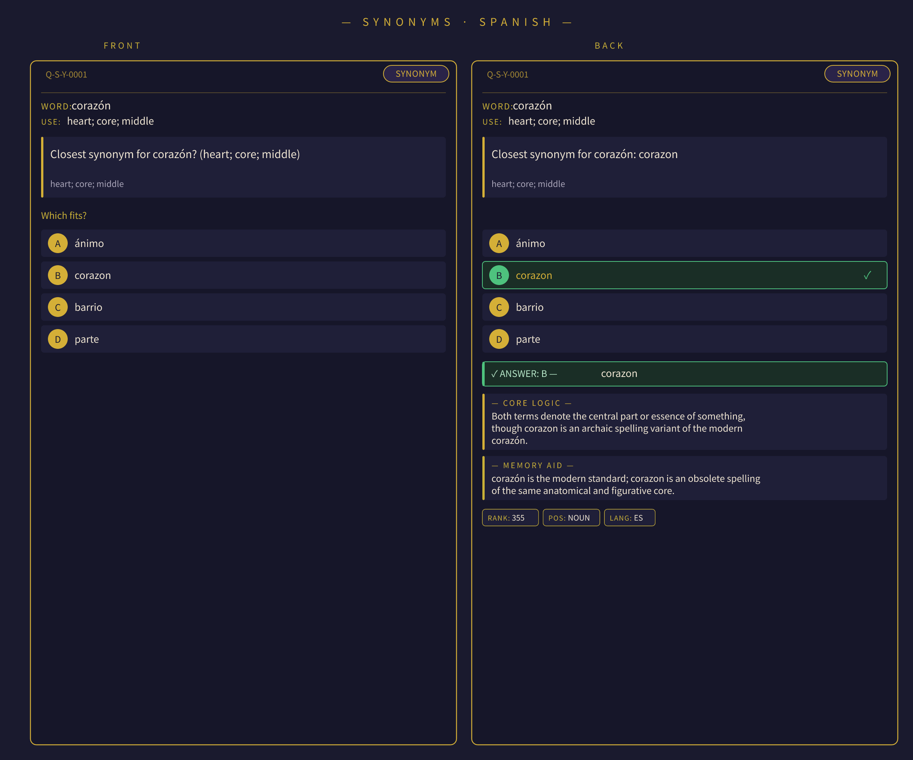](docs/previews/synonym-spanish.png) |
| Honorifics / Register   | [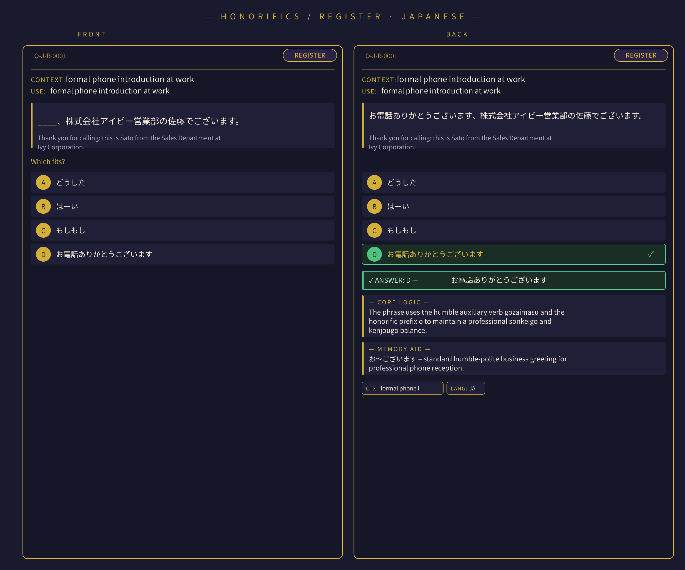](docs/previews/register-japanese.png) |

</details>

---

## Downloads

All decks are hosted on Google Cloud Storage. Direct download — no signup. Import into Anki Desktop with **File → Import**.

> **▶ What to study:** the recommended study path is the
> [**Progressive Course**](#-progressive-course--the-flagship) above (units in order, A1→native).
> The decks below are the **content pool** the course is assembled from — download them for
> reference/drill. Within the pool, the **Vocab-MCQ Recognition + Recall** decks are the
> QA-passed, fully-leveled set (full A1–B2, all 5 languages incl. French); the other decks are
> published for preview but **pending quality review**, so treat those as experimental.

### 🌐 Global decks — one file, all languages, level-tiered

Each global deck is a single `.apkg` with a 3-tier nested structure:

```
{Type}.apkg
  └── {Type}::Spanish
        ├── {Type}::Spanish::A1   ← cards sorted by frequency rank (most common first)
        ├── {Type}::Spanish::A2
        ├── {Type}::Spanish::B1
        └── {Type}::Spanish::B2
  └── {Type}::Japanese / Chinese / Korean / French (same A1→B2 split; French in Vocab-MCQ)
```

Inside each level subdeck, cards are sorted **by frequency** — top-1000 words first, then 1K-3K, etc. Anki's review order respects this, so you learn high-frequency / lower-CEFR cards before rare / higher-CEFR ones automatically.

**Pronunciation:** Every cloze-MCQ and Numbers card now carries IPA (International Phonetic Alphabet) transcriptions in the original ebook format — full sentence in the prompt panel, answer-word repeated below the green ✓ banner. Generated via `espeak-ng + epitran` (Spanish), `pykakasi + pyopenjtalk` (Japanese), `pypinyin + pinyin_to_ipa` (Chinese), and rule-based Hangul→IPA (Korean). Format: `/word | word | word↘ ‖/` with `|` for word boundaries, `↘ ‖` for sentence-final declaratives.

**Level assignment per deck type:**

[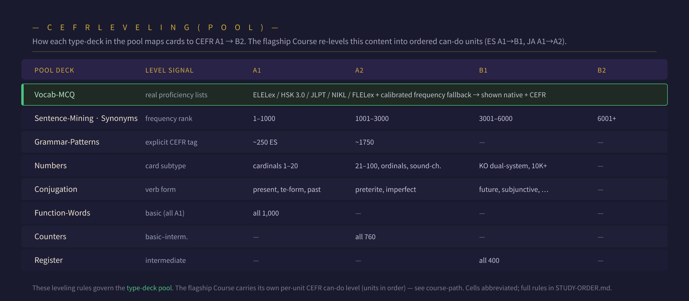](docs/level-assignment.png)

<sub>Click to open full-size and zoom in. Full per-language rules: `Phase 11-Global-Decks/STUDY-ORDER.md`.</sub>

**Vocab-MCQ CEFR levels** come from real per-language proficiency standards, shown on
each card as native + CEFR (e.g. `A2 (HSK3)`): **ELELex/CEFRLex** (Spanish),
**HSK 3.0** (Chinese), **JLPT** (Japanese), **NIKL 국제통용 6-level** (Korean),
**FLELex/CEFRLex** (French). Words not in a
list use a per-language frequency tier *calibrated* against where listed words fall in
our OpenSubtitles corpus ranking (shown as `(freq)`). See `docs/specs/SPEC-LANG-002`.

### 📚 Studying the raw pool decks (advanced / self-directed)
If you'd rather drill the type-decks directly instead of following the
[course](#-progressive-course--the-flagship), they're **parallel CEFR-gated tracks**, not
sequential blocks. Function words aren't gated — they're the highest-frequency words (~50% of
all text), so learn them **from day one**. Grammar and conjugation need a vocabulary base to
attach to, so they unlock once you hold the high-frequency core:

1. **Start together:** Function-Words · Vocab-MCQ (A1) · Numbers (1–20).
2. **At ~the top 1,000 words (A1 vocab tier):** add **Conjugation A1** + **Grammar A1**.
3. **A2 vocab** → Conjugation A2 · Grammar A2 · Counters.
4. **B1+ vocab** → Synonyms · Sentence-Mining · Register.

Rule of thumb: **~300–500 words to *begin* grammar/conjugation, ~1,000 (the A1 tier) to
progress comfortably** (≈80–85% spoken-text coverage). Full policy + per-language
thresholds + deck-unlock matrix: `Phase 11-Global-Decks/STUDY-ORDER.md`.

<details>
<summary><b>🌐 Click to expand global multi-language decks</b></summary>

_Ordered to match the [deck catalog](#deck-catalog-content-pool). These decks form the **content pool**; the [course](#-progressive-course--the-flagship) is the recommended study path. **✅ QA-passed** = fully leveled + validated; **⏳ pending QA** = downloadable but not yet validated._

| Deck (global) | Status | Cards | File |
|---|---|------:|------|
| **Vocab-MCQ-Recognition** | ✅ **QA-passed** | 34,124 | [⬇ Vocab-MCQ-Recognition.apkg](https://storage.googleapis.com/aol-language-decks-v2/v2/global/Vocab-MCQ-Recognition.apkg) (380 MB · incl. 🔊 audio) |
| **Vocab-MCQ-Recall** | ✅ **QA-passed** | 34,124 | [⬇ Vocab-MCQ-Recall.apkg](https://storage.googleapis.com/aol-language-decks-v2/v2/global/Vocab-MCQ-Recall.apkg) (379 MB · incl. 🔊 audio) |
| **Function-Words** | ⏳ pending QA | 994 | [⬇ Function-Words.apkg](https://storage.googleapis.com/aol-language-decks-v2/v2/global/Function-Words.apkg) (2.2 MB) |
| **Grammar-Patterns** | ⏳ pending QA | 1,995 | [⬇ Grammar-Patterns.apkg](https://storage.googleapis.com/aol-language-decks-v2/v2/global/Grammar-Patterns.apkg) (4.3 MB) |
| **Sentence-Mining** | ⏳ pending QA | 37,299 | [⬇ Sentence-Mining.apkg](https://storage.googleapis.com/aol-language-decks-v2/v2/global/Sentence-Mining.apkg) (79 MB) |
| **Conjugation** | ⏳ pending QA | 1,973 | [⬇ Conjugation.apkg](https://storage.googleapis.com/aol-language-decks-v2/v2/global/Conjugation.apkg) (4.5 MB) |
| **Counters** _(ja/zh/ko)_ | ⏳ pending QA | 760 | [⬇ Counters.apkg](https://storage.googleapis.com/aol-language-decks-v2/v2/global/Counters.apkg) (1.7 MB) |
| **Synonyms** | ⏳ pending QA | 7,963 | [⬇ Synonyms.apkg](https://storage.googleapis.com/aol-language-decks-v2/v2/global/Synonyms.apkg) (17 MB) |
| **Register** _(ja/ko)_ | ⏳ pending QA | 400 | [⬇ Register.apkg](https://storage.googleapis.com/aol-language-decks-v2/v2/global/Register.apkg) (1.7 MB) |
| **Numbers** | ⏳ pending QA | 1,258 | [⬇ Numbers.apkg](https://storage.googleapis.com/aol-language-decks-v2/v2/global/Numbers.apkg) (2.1 MB) |

> **Total: 120,890 cards across 10 global decks** — audited via 20-layer
> QA pipeline (`Phase 11-Global-Decks/`); bucket is publicly readable so
> the HTTPS links work without authentication.
>
> **Vocab-MCQ scaled to full A1–B2 + French (SPEC-LANG-003).** The
> Recognition/Recall decks now cover the complete A–B vocabulary for **5 languages**
> (es 9,107 · ja 4,046 · zh 3,998 · ko 8,605 · **fr 8,368** = 34,124 cards each),
> with lemma-labeled glosses, sound-link/radical mnemonics, BGE-M3 distractors, and
> real CEFR levels (ELELex/HSK 3.0/JLPT/NIKL/**FLELex**) shown as native+CEFR. Every card
> also carries a natural **example sentence** with English translation (gemini-3.5-flash,
> MIPROv2-tuned for accuracy + naturalness) — **all five languages at ~100% coverage**
> (es 100% · ja 100% · zh 99.9% · ko 99.9% · fr 99.9%). The other deck types remain 4-language.
> _(Legacy Vocabulary-Classic retired, SPEC-LANG-002.)_
>
> **MCQ decks refined (top-500/language).** The Vocab-MCQ-Recognition/Recall
> decks were rebuilt as a curated **top-520 content words per language** set
> (replacing the 39,906-card mega decks) with three quality upgrades: glosses
> standardized via LLM normalization (no Wiktionary markup/inflection dumps),
> a new **memory-aid mnemonic** on every card (sound-link for es/ko, character/
> radical decomposition for zh/ja), and collocations rebuilt from a single
> **OpenSubtitles** corpus of truth (count-then-NPMI ranked, cross-script
> filtered). BGE-M3 embedding distractors unchanged. See `docs/specs/SPEC-001`.
>
> **QA hardening pass.** A randomized-sample review drove four further fixes:
> foreign-script/English-token junk cards removed (`и`, `ﺎ`, `hey`, `sr.`);
> Chinese normalized to **Simplified-only** (OpenCC `t2s`, Trad/Simpl duplicates
> merged); collocation proper-noun noise suppressed via a partner frequency-rank
> gate + per-word display floor; and duplicate collocation rows de-duplicated.
> Full-deck audit: 0 junk · 0 Traditional · 100% gloss + mnemonic coverage ·
> 0 markup. See `Phase 11-Global-Decks/REFINEMENT-PLAYBOOK.md` §S6.
>
> **Real CEFR levels + Classic retired.** MCQ card levels now come from real
> proficiency standards (ELELex/HSK 3.0/JLPT/NIKL 국제통용), shown as native + CEFR
> (`A2 (HSK3)`), with a corpus-calibrated frequency fallback (`(freq)`). The legacy
> 39,906-card **Vocabulary-Classic** deck was retired. See `docs/specs/SPEC-LANG-002`.

#### 🔒 Integrity verification

All downloads are served over **HTTPS (TLS 1.2+, HSTS)** via
`storage.googleapis.com`. Verify file integrity with the published
SHA-256 manifest:

```bash
# Download the manifest, then verify every .apkg in your local apkg/ dir:
curl -O https://storage.googleapis.com/aol-language-decks-v2/v2/global/SHA256SUMS
cd apkg/ && sha256sum -c ../SHA256SUMS
```

| Deck | SHA-256 |
|------|---------|
| Conjugation.apkg | `61890a6220b94002fc71b03f9b9493f8f11a571846fb604c52e40ec2679ec7e6` |
| Counters.apkg | `9b050437f531feab68624e444f9103bf34cd47ab7d16fa3e6b6dbf02c77137ff` |
| Function-Words.apkg | `a4815ca9766a2245ce61c20e79a9fede8ece4aaa1fa6f77282baae03b0edc2f0` |
| Grammar-Patterns.apkg | `6800a0895b14d591ab0fdfcaeeb0767e997439b91a356f1c497d03ed55bcf0eb` |
| Numbers.apkg | `03a2310573bf5ee5b65ba1b1e16fcad8aa031aa6082bf315394438206359d7a0` |
| Register.apkg | `dbd28e7e57fd7f5e6ed45a55d1659b85b10e87748ef821c51a500c44b85aa6cb` |
| Sentence-Mining.apkg | `35edac373d6c8c5e3331e55412bbfadb817cd248c67f65c5266ce9591ca4307d` |
| Synonyms.apkg | `8667e1bda24c8d69d58b41e9fbcaa32580c9970c10248871cdc2692ab026cf89` |
| Vocab-MCQ-Recall.apkg | `8db1bf943cd2b8eaa1ac0faaca56d30c6e48785ac76145f62449164aa9bc5778` |
| Vocab-MCQ-Recognition.apkg | `d6db1fdb5aa94d86a5b820087ee5ccc1d4faad542a91f8f43e9202c9c4e84e39` |

</details>

### 📦 Per-language decks (if you only want one language)

> **All per-language decks are ⏳ pending QA** — within the content pool, the global
> **Vocab-MCQ** decks (above) are the QA-passed set, and the
> [course](#-progressive-course--the-flagship) is the recommended study path. Columns are
> ordered to match the [deck catalog](#deck-catalog-content-pool); Classic vocab was retired
> (SPEC-LANG-002) and is kept only for archival download.

<details>
<summary><b>📦 Vocabulary decks (one row per language) — click to expand</b></summary>

| Language | MCQ Recognition | MCQ Recall | Classic Vocab _(retired)_ |
|----------|-----------------|------------|---------------------------|
| **Spanish**  | [⬇ MCQ Recognition](https://storage.googleapis.com/aol-language-decks-v2/v2/es/Vocab-MCQ-Recognition-Spanish-OpenSubs.apkg) (40 MB) | [⬇ MCQ Recall](https://storage.googleapis.com/aol-language-decks-v2/v2/es/Vocab-MCQ-Recall-Spanish-OpenSubs.apkg) (21 MB) | [⬇ Vocab](https://storage.googleapis.com/aol-language-decks-v2/v2/es/Vocab-Spanish-OpenSubs.apkg) (4.2 MB) |
| **Japanese** | [⬇ MCQ Recognition](https://storage.googleapis.com/aol-language-decks-v2/v2/ja/Vocab-MCQ-Recognition-Japanese-OpenSubs.apkg) (40 MB) | [⬇ MCQ Recall](https://storage.googleapis.com/aol-language-decks-v2/v2/ja/Vocab-MCQ-Recall-Japanese-OpenSubs.apkg) (22 MB) | [⬇ Vocab](https://storage.googleapis.com/aol-language-decks-v2/v2/ja/Vocab-Japanese-OpenSubs.apkg) (5.2 MB) |
| **Chinese**  | [⬇ MCQ Recognition](https://storage.googleapis.com/aol-language-decks-v2/v2/zh/Vocab-MCQ-Recognition-Chinese-OpenSubs.apkg) (40 MB) | [⬇ MCQ Recall](https://storage.googleapis.com/aol-language-decks-v2/v2/zh/Vocab-MCQ-Recall-Chinese-OpenSubs.apkg) (25 MB) | [⬇ Vocab](https://storage.googleapis.com/aol-language-decks-v2/v2/zh/Vocab-Chinese-OpenSubs.apkg) (5.5 MB) |
| **Korean**   | [⬇ MCQ Recognition](https://storage.googleapis.com/aol-language-decks-v2/v2/ko/Vocab-MCQ-Recognition-Korean-OpenSubs.apkg) (40 MB) | [⬇ MCQ Recall](https://storage.googleapis.com/aol-language-decks-v2/v2/ko/Vocab-MCQ-Recall-Korean-OpenSubs.apkg) (24 MB) | [⬇ Vocab](https://storage.googleapis.com/aol-language-decks-v2/v2/ko/Vocab-Korean-OpenSubs.apkg) (4.7 MB) |

</details>

<details>
<summary><b>📦 Cloze-MCQ decks (with reasoning) — click to expand</b></summary>

| Language | Function-Word | Grammar-Pattern | Sentence-Mining | Conjugation | Counter | Synonyms | Register |
|----------|---|---|---|---|---|---|---|
| **Spanish**  | [⬇](https://storage.googleapis.com/aol-language-decks-v2/v2/es/Function-Spanish-OpenSubs.apkg) | [⬇](https://storage.googleapis.com/aol-language-decks-v2/v2/es/Grammar-Spanish-OpenSubs.apkg) | [⬇](https://storage.googleapis.com/aol-language-decks-v2/v2/es/SentenceMining-Spanish-OpenSubs.apkg) | [⬇](https://storage.googleapis.com/aol-language-decks-v2/v2/es/Conjugation-Spanish-Drill.apkg) | — | [⬇](https://storage.googleapis.com/aol-language-decks-v2/v2/es/Synonyms-Spanish-OpenSubs.apkg) | — |
| **Japanese** | [⬇](https://storage.googleapis.com/aol-language-decks-v2/v2/ja/Function-Japanese-OpenSubs.apkg) | [⬇](https://storage.googleapis.com/aol-language-decks-v2/v2/ja/Grammar-Japanese-OpenSubs.apkg) | [⬇](https://storage.googleapis.com/aol-language-decks-v2/v2/ja/SentenceMining-Japanese-OpenSubs.apkg) | [⬇](https://storage.googleapis.com/aol-language-decks-v2/v2/ja/Conjugation-Japanese-Drill.apkg) | [⬇](https://storage.googleapis.com/aol-language-decks-v2/v2/ja/Counter-Japanese-Drill.apkg) | [⬇](https://storage.googleapis.com/aol-language-decks-v2/v2/ja/Synonyms-Japanese-OpenSubs.apkg) | [⬇](https://storage.googleapis.com/aol-language-decks-v2/v2/ja/Register-Japanese-Drill.apkg) |
| **Chinese**  | [⬇](https://storage.googleapis.com/aol-language-decks-v2/v2/zh/Function-Chinese-OpenSubs.apkg) | [⬇](https://storage.googleapis.com/aol-language-decks-v2/v2/zh/Grammar-Chinese-OpenSubs.apkg) | [⬇](https://storage.googleapis.com/aol-language-decks-v2/v2/zh/SentenceMining-Chinese-OpenSubs.apkg) | [⬇](https://storage.googleapis.com/aol-language-decks-v2/v2/zh/Conjugation-Chinese-Drill.apkg) | [⬇](https://storage.googleapis.com/aol-language-decks-v2/v2/zh/Counter-Chinese-Drill.apkg) | [⬇](https://storage.googleapis.com/aol-language-decks-v2/v2/zh/Synonyms-Chinese-OpenSubs.apkg) | — |
| **Korean**   | [⬇](https://storage.googleapis.com/aol-language-decks-v2/v2/ko/Function-Korean-OpenSubs.apkg) | [⬇](https://storage.googleapis.com/aol-language-decks-v2/v2/ko/Grammar-Korean-OpenSubs.apkg) | [⬇](https://storage.googleapis.com/aol-language-decks-v2/v2/ko/SentenceMining-Korean-OpenSubs.apkg) | [⬇](https://storage.googleapis.com/aol-language-decks-v2/v2/ko/Conjugation-Korean-Drill.apkg) | [⬇](https://storage.googleapis.com/aol-language-decks-v2/v2/ko/Counter-Korean-Drill.apkg) | [⬇](https://storage.googleapis.com/aol-language-decks-v2/v2/ko/Synonyms-Korean-OpenSubs.apkg) | [⬇](https://storage.googleapis.com/aol-language-decks-v2/v2/ko/Register-Korean-Drill.apkg) |

</details>

Per-language pages have the full table with file sizes and sample-card links: **[Spanish](es/) · [French](fr/) · [Japanese](ja/) · [Chinese](zh/) · [Korean](ko/)**

---

## What's in each deck type

- **Classic vocab card** — Word + IPA (and Pinyin for Chinese) on the front; English meaning, example sentence, top collocations on the back.
- **MCQ Recognition** — English definition shown; user picks the matching target-language word out of six options.
- **MCQ Recall** — Target-language word + IPA shown; user picks the matching English definition out of six options.
  - _Both MCQ decks show a **color-coded example sentence** on the back: each target-language word and its English translation share a color (grammatical/function words are gray), so word order and grammar — e.g. SOV→SVO reordering, particles, negation — are visible at a glance._
  - _**Spoken pronunciation 🔊** — every headword carries a native-speaker **male voice** clip whose pronunciation is **phoneme-forced** from the data already on the card (IPA for Spanish/French, kana for Japanese, pinyin for Chinese; Korean reads its phonetic Hangul) — so even single-letter function words say the word, not the letter-name. Generated with Google Cloud TTS neural voices, loudness-equalized, and **autoplaying three times** where the word is the focus: the **front of Recall** cards and the **back of Recognition** cards._
  - _**Japanese furigana** — kanji headwords show their **kana reading** beside the word (車 → くるま), with the reading, IPA, and audio all derived from one analyzer (pyopenjtalk) so they always agree._
- **Function-Word Cloze** — A sentence with a function word blanked. 4 options with one correct + 3 sentence-aware distractors. Back reveals the answer + a one-sentence rule explanation.
- **Grammar-Pattern Cloze** — A sentence drilling a specific grammar pattern (`〜たい`, `comparativos`, `V不V`, `〜은 적이 있어요`, etc.). Distractors are *typed* (tense / confusable / register variant).
- **Sentence-Mining Cloze** — Top-frequency vocab word blanked inside its real-corpus example sentence. 4-option MCQ from the same word's pre-built distractor pool.
- **Conjugation Drill** — A sentence requiring the correct tense/aspect/agreement form of a target verb. Distractors are *other legitimate forms of the same verb*.
- **Counter / Measure-Word** — Pick the right counter for the noun being quantified (`本を三____買いました` → `冊`).
- **Synonyms** — Pick the closest synonym for a target word. Every candidate pair was binary-verified by Gemini, fixing the CJK character-overlap failure mode.
- **Honorifics / Register** — Choose the speech-level-appropriate expression for a stated social context (formal email vs casual peer chat, etc.).

---

## Frequency lists (the 50K word source)

Each language folder ships the underlying frequency list — all from **HermitDave's
OpenSubtitles 2018 FrequencyWords** (`{lang}_50k`), the single corpus source of truth:

- [`es/words/es-frequency-list.txt`](es/words/es-frequency-list.txt) — 50,000 entries
- [`fr/words/fr-frequency-list.txt`](fr/words/fr-frequency-list.txt) — 50,000 entries _(French, HermitDave `fr_50k`)_
- [`ja/words/ja-frequency-list-unidic.txt`](ja/words/ja-frequency-list-unidic.txt) — **42,833 UniDic dictionary forms** (our re-tokenize)
- [`ja/words/ja-frequency-list-ipadic-original.txt`](ja/words/ja-frequency-list-ipadic-original.txt) — 34,504 entries, original IPAdic source (kept for transparency)
- [`zh/words/zh-frequency-list.txt`](zh/words/zh-frequency-list.txt) — 50,000 entries
- [`ko/words/ko-frequency-list.txt`](ko/words/ko-frequency-list.txt) — 50,000 entries

Format: `word count\n` per line, sorted descending by corpus frequency. French is also a
**global-only** study language (no standalone `fr/*.apkg`); its list is shipped here as the
source behind the French Vocab-MCQ cards. CEFR overlay for French is **FLELex** (CEFRLex) —
see [`fr/`](fr/) and the attribution below.

---

## How it was built

High-level data flow:

[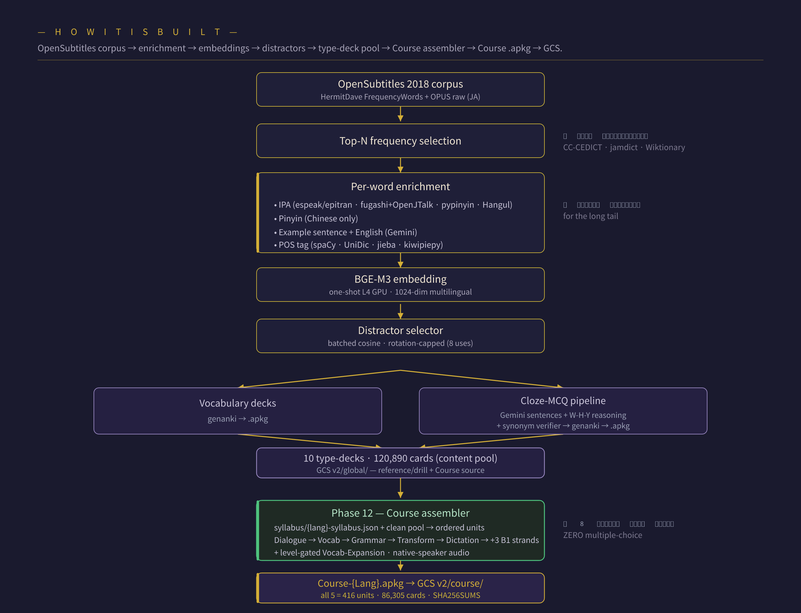](docs/pipeline.png)

<sub>Click the diagram to open it full-size and zoom in.</sub>

See:
- [`docs/architecture.md`](docs/architecture.md) — full pipeline
- [`docs/distractor-design.md`](docs/distractor-design.md) — the 2/2/1 recipe + rotation math
- [`docs/ja-unidic-rebuild.md`](docs/ja-unidic-rebuild.md) — why and how we rebuilt the Japanese vocab pool
- [`docs/cloze-mcq-design.md`](docs/cloze-mcq-design.md) — cloze-MCQ card format + reasoning block

---

## Quality assurance

Three independent audits run on every release:

1. **Source-data audit** — for every card: answer ∈ options, 4 distinct options, no empty fields, answer present in sentence, blank marker present, English present, Explanation present.
2. **APKG file audit** — extracts the sqlite under each .apkg; verifies field count, no answer leak on the front, the correct option marked on the back.
3. **Randomization audit** — verifies the correct answer is uniformly distributed across A/B/C/D positions (within statistical expectation), no positional bias.

Latest release (May 2026): **0 issues, χ² < 12 on every cloze-MCQ deck.**

---

## Attribution & sources

This project stands on the shoulders of:

- **OpenSubtitles 2018** (via [OPUS](http://opus.nlpl.eu/OpenSubtitles-v2018.php) and [HermitDave/FrequencyWords](https://github.com/hermitdave/FrequencyWords)) — raw subtitle corpora and frequency lists. Licensed for academic and research use.
- **[BAAI/bge-m3](https://huggingface.co/BAAI/bge-m3)** — multilingual embedding model (MIT license).
- **[Google Gemini](https://ai.google.dev/) (via OpenRouter)** — example-sentence generation, definition fallback, reasoning generation, and synonym verification.
- **Tokenizers / lemmatizers:**
  - **[fugashi](https://github.com/polm/fugashi)** + **[unidic-lite](https://github.com/polm/unidic-lite)** for Japanese (GPL/MIT)
  - **[jieba](https://github.com/fxsjy/jieba)** for Chinese (MIT)
  - **[spaCy](https://spacy.io/) `es_core_news_sm`** for Spanish (MIT)
  - **[kiwipiepy](https://github.com/bab2min/kiwipiepy)** for Korean (LGPL)
  - **[simplemma](https://github.com/adbar/simplemma)** for French + Spanish lemmatization (MIT)
- **CEFR proficiency lists** (level overlay): **ELELex/CEFRLex** (es), **HSK 3.0** (zh),
  **JLPT** (ja), **NIKL 국제통용** (ko), **[FLELex/CEFRLex](https://cental.uclouvain.be/cefrlex/)** (fr) — CEFRLex sets CC BY-NC-SA, used for personal/educational study.
- **Dictionaries** for free-tier gloss lookup:
  - **[CC-CEDICT](https://www.mdbg.net/chinese/dictionary?page=cc-cedict)** (CC-BY-SA 4.0) for Chinese
  - **[jamdict](https://github.com/neocl/jamdict)** wrapping JMdict (Creative Commons BY-SA)
  - **[Wiktionary](https://www.wiktionary.org/)** REST + wikitext (CC-BY-SA)
- **IPA generation:**
  - **[espeak-ng](https://github.com/espeak-ng/espeak-ng)** + **[epitran](https://github.com/dmort27/epitran)** for Spanish (`spa-Latn`) and French (`fra-Latn`)
  - **fugashi + [OpenJTalk](http://open-jtalk.sourceforge.net/)** for Japanese
  - **[pypinyin](https://github.com/mozillazg/python-pinyin) + [pinyin-to-ipa](https://github.com/stefanstaplerstudio/pinyin-to-ipa)** for Chinese
  - Rule-based Hangul-to-IPA for Korean
- **Spoken audio (Vocab-MCQ):** **[Google Cloud Text-to-Speech](https://cloud.google.com/text-to-speech)**
  neural voices — one native-speaker male voice per language, with pronunciation **phoneme-forced**
  from the card's own data (IPA `<phoneme>` for es/fr, kana for ja, pinyin for zh; Korean reads
  Hangul natively) so isolated function words are spoken correctly rather than as letter-names.
  Every clip loudness-equalized (RMS −18 dB + limiter, via ffmpeg) and bundled into the `.apkg`
  as `[sound:]` media; autoplays 3× on Recall fronts / Recognition backs.
- **[genanki](https://github.com/kerrickstaley/genanki)** — `.apkg` packaging (MIT).

All third-party libraries used in their original form, no modifications.

---

## License

MIT — see [LICENSE](LICENSE).

The included frequency lists (`*/words/*.txt`) are derived from OpenSubtitles 2018 via HermitDave/FrequencyWords and are redistributed under the spirit of that project's terms. If you build on these decks, please credit OpenSubtitles 2018 and HermitDave/FrequencyWords.
