# Language-Learning-V2

Curated multilingual flashcards for **Spanish, French, Japanese, Chinese (Mandarin), and Korean**.

**120,890 cards across 10 global decks.** The **Vocab-MCQ Recognition + Recall** decks
(68,248 cards · full A1–B2 · **all 5 languages incl. French**) are the actively-maintained,
QA-passed **study set**. The other global decks (Function-Words, Grammar-Patterns,
Sentence-Mining, Conjugation, Counters, Synonyms, Register, Numbers) and the legacy
per-language decks are **downloadable but pending quality review** — not yet validated for
study. Every cloze-MCQ card has a `— W H Y —` reasoning block on the back generated by Gemini.

> Previous version: [DEPRECATED-Language-Learning-Journey](https://github.com/RexRenatus/DEPRECATED-Language-Learning-Journey) (archived).

---

## What's new

| Aspect | v1 (deprecated) | v2 (current) |
|--------|----|----|
| Card formats | Classic only | Classic + MCQ Recognition + MCQ Recall + 5 new cloze-MCQ deck types |
| Distractors (vocab) | n/a | 6-option MCQ; 2 near-semantic + 2 frequency-decile + 1 form-confusable |
| Distractors (cloze) | n/a | 4-option MCQ; sentence-aware or typed (tense / confusable / register) |
| Distractor similarity | n/a | **BGE-M3** 1024-dim multilingual cosine |
| Distractor rotation | n/a | Capped at 8 uses per pool word; full pool covered |
| Reasoning on back | n/a | **`— W H Y —` block** on every non-vocab card, Gemini-generated |
| Example sentences | Harry Potter corpus only | **Gemini-curated** short canonical sentences (8–14 words) with English translations |
| Japanese tokenization | IPAdic stems (`走` + `る`) | **UniDic dictionary forms** (`走る` as a single lemma) |
| Japanese vocab pool | 34,504 stem-soup entries | 42,833 clean lemmas |
| Decks per language | 1 | 8–10 |
| Active study set | 40,000 (classic) | **Vocab-MCQ: 68,248 cards, 5 langs, A1–B2** |
| Global decks (all types) | — | **120,890 across 10 decks** (non-MCQ pending QA) |

For the Japanese rebuild story, see [`docs/ja-unidic-rebuild.md`](docs/ja-unidic-rebuild.md).

---

## Deck catalog

[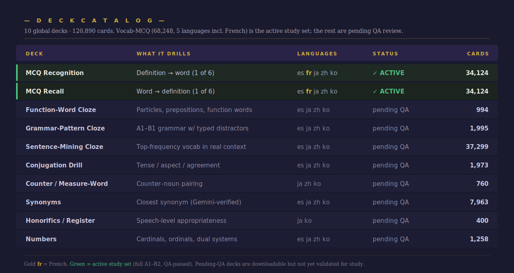](docs/deck-catalog.svg)

<sub>Click the catalog to open it full-size and zoom in.</sub>

Per-language pages: **[Spanish](es/) · [French](fr/) · [Japanese](ja/) · [Chinese](zh/) · [Korean](ko/)**

See [`docs/cloze-mcq-design.md`](docs/cloze-mcq-design.md) for the cloze-MCQ card format, including the reasoning block.

---

## Card previews

Every interactive card uses the Imperial Golden Age theme — gold accents on dark navy, with a structured back: green ✓ ANSWER banner, **CORE LOGIC** section explaining the rule, **MEMORY AID** section with deck-specific framing (pattern formula / etymology / paradigm hint / visual analogy / nuance distinction / social-context cue), and footer metadata pills.

<details>
<summary><b>🔎 Click to see real card previews (front + back) per deck type</b></summary>

### Vocabulary decks

| Deck | Preview |
|------|---------|
| Vocab MCQ Recognition | [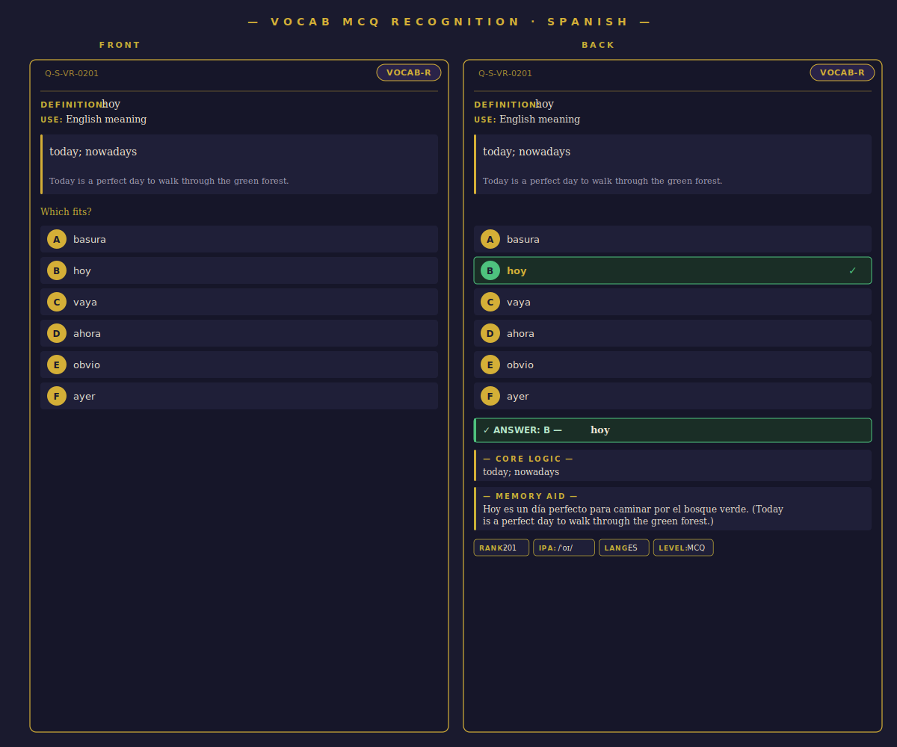](docs/previews/vocab-recognition-spanish.svg) |
| Vocab MCQ Recall      | [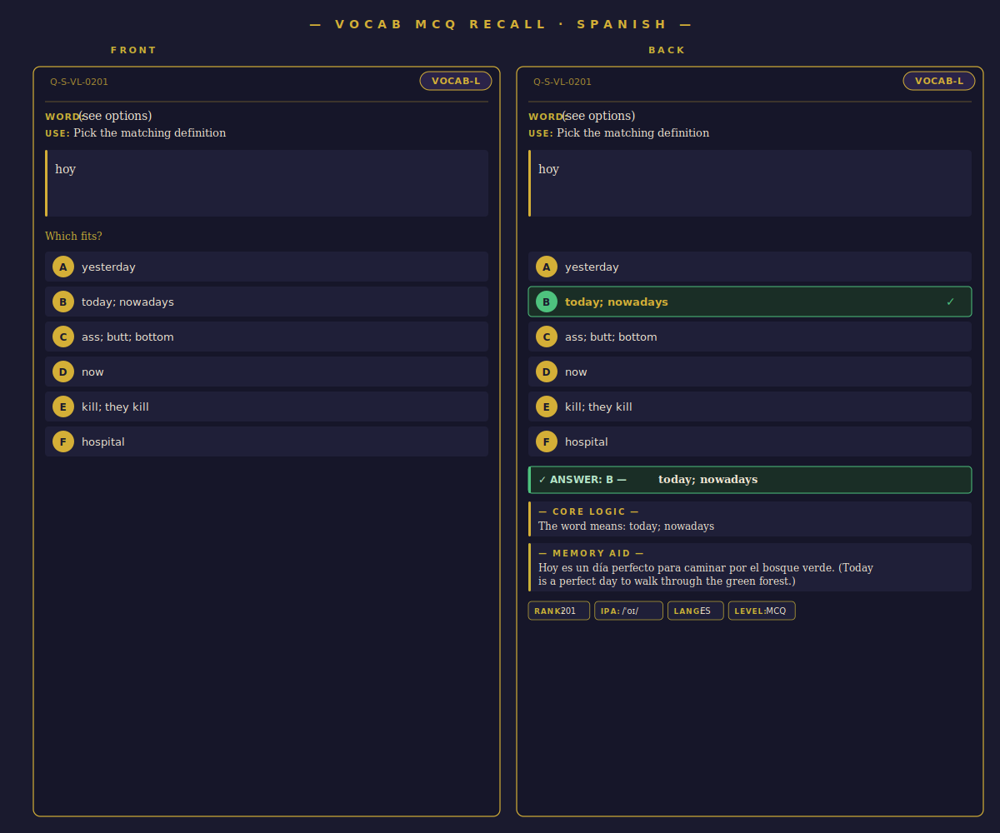](docs/previews/vocab-recall-spanish.svg) |

### Cloze-MCQ decks (with `— W H Y —` reasoning)

| Deck | Preview |
|------|---------|
| Function-Word Cloze     | [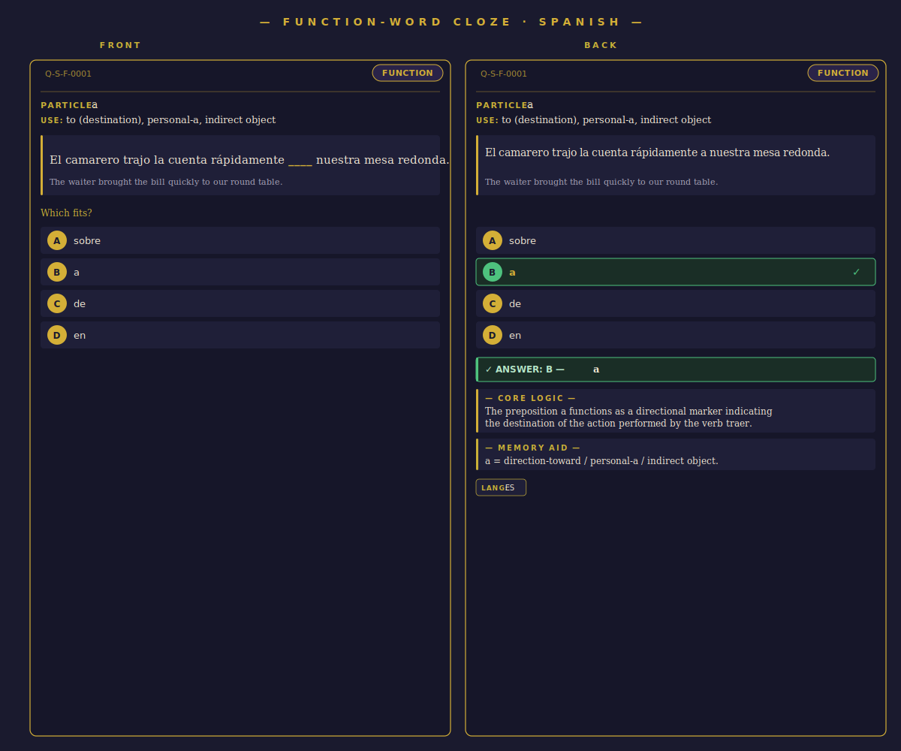](docs/previews/function-spanish.svg) |
| Grammar-Pattern Cloze   | [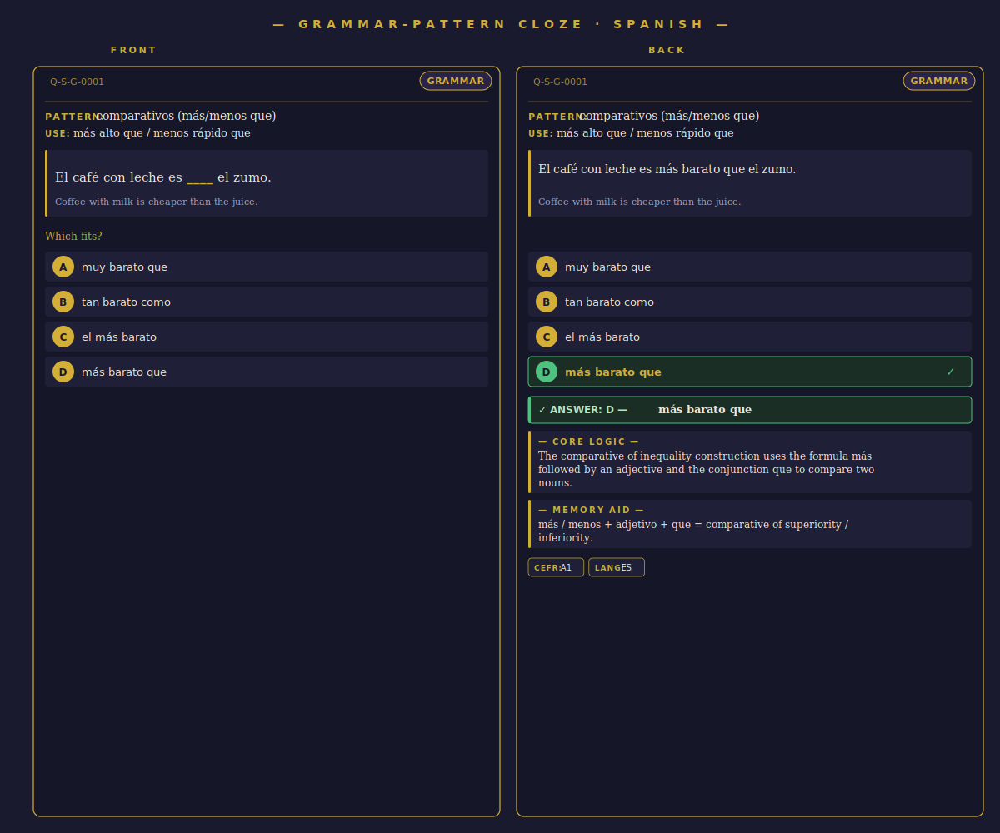](docs/previews/grammar-spanish.svg) |
| Sentence-Mining Cloze   | [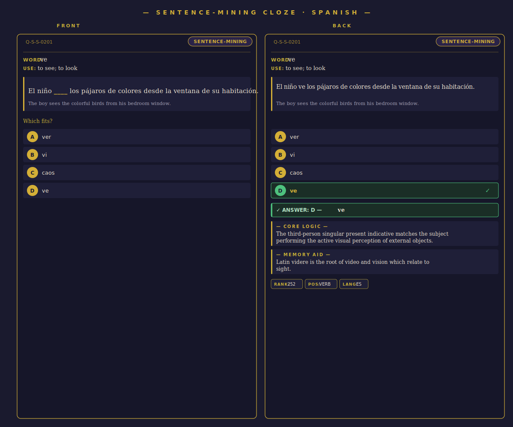](docs/previews/sentence-mining-spanish.svg) |
| Conjugation Drill       | [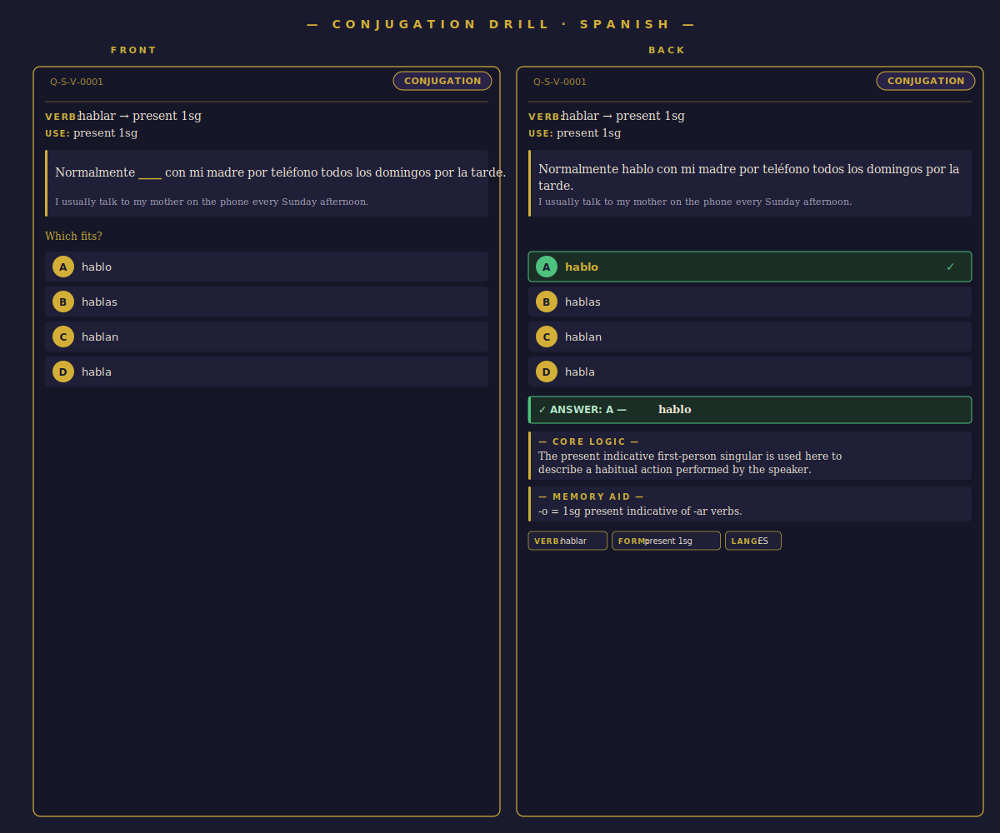](docs/previews/conjugation-spanish.svg) |
| Counter / Measure-Word  | [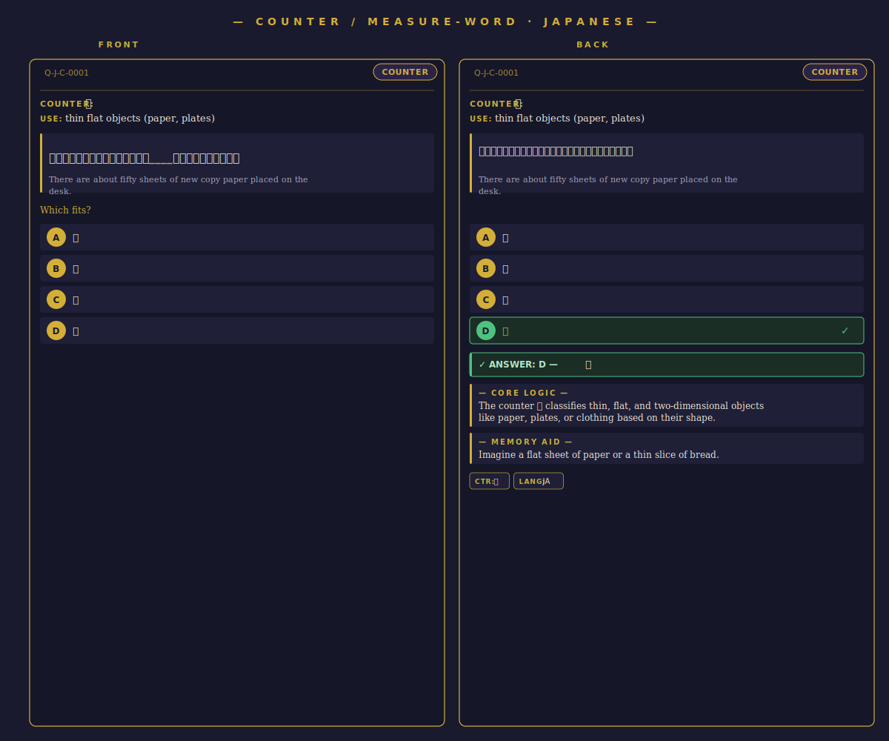](docs/previews/counter-japanese.svg) |
| Synonyms                | [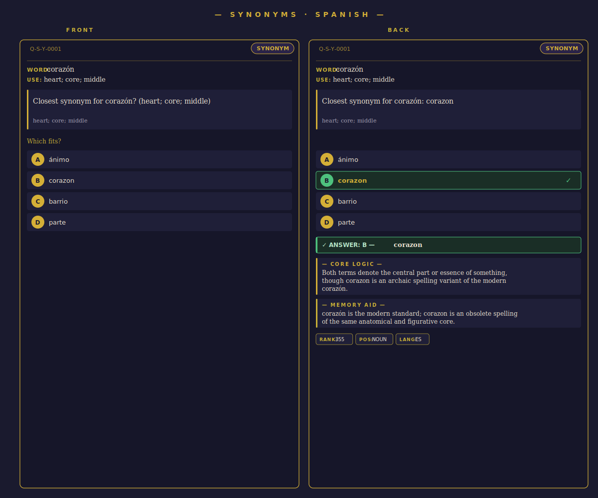](docs/previews/synonym-spanish.svg) |
| Honorifics / Register   | [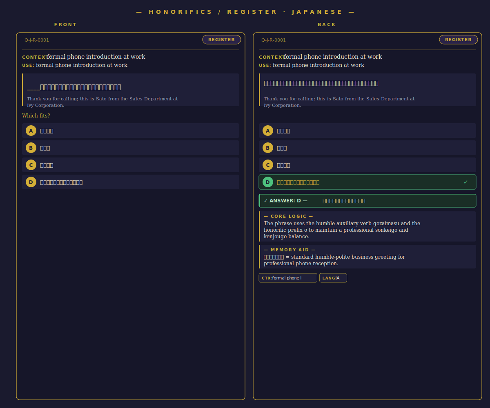](docs/previews/register-japanese.svg) |

</details>

---

## Downloads

All decks are hosted on Google Cloud Storage. Direct download — no signup. Import into Anki Desktop with **File → Import**.

> **▶ What to study:** the **Vocab-MCQ Recognition + Recall** global decks are the only
> actively-maintained, QA-passed decks (full A1–B2, all 5 languages incl. French). Every
> other deck here — the other global decks **and** all per-language decks — is published for
> preview but **pending quality review**, so treat them as experimental until validated.

### 🌐 Global decks — one file, all languages, level-tiered

Each global deck is a single `.apkg` with a 3-tier nested structure:

```
{Type}.apkg
  └── {Type}::Spanish
        ├── {Type}::Spanish::A1   ← cards sorted by frequency rank (most common first)
        ├── {Type}::Spanish::A2
        ├── {Type}::Spanish::B1
        └── {Type}::Spanish::B2
  └── {Type}::Japanese / Chinese / Korean / French (same A1→B2 split; French in Vocab-MCQ)
```

Inside each level subdeck, cards are sorted **by frequency** — top-1000 words first, then 1K-3K, etc. Anki's review order respects this, so you learn high-frequency / lower-CEFR cards before rare / higher-CEFR ones automatically.

**Pronunciation:** Every cloze-MCQ and Numbers card now carries IPA (International Phonetic Alphabet) transcriptions in the original ebook format — full sentence in the prompt panel, answer-word repeated below the green ✓ banner. Generated via `espeak-ng + epitran` (Spanish), `pykakasi + pyopenjtalk` (Japanese), `pypinyin + pinyin_to_ipa` (Chinese), and rule-based Hangul→IPA (Korean). Format: `/word | word | word↘ ‖/` with `|` for word boundaries, `↘ ‖` for sentence-final declaratives.

**Level assignment per deck type:**

| Deck | Level signal | A1 | A2 | B1 | B2 |
|------|----|----|----|----|----|
| Vocab-MCQ-* | **real proficiency lists** + freq fallback | \(see below\) | | | |
| Sentence-Mining, Synonyms | frequency rank | rank 1–1000 | 1001–3000 | 3001–6000 | 6001+ |
| Grammar-Patterns | explicit CEFR tag | ~250 ES (A1) | ~1750 (A2) | — | — |
| Numbers | card subtype | cardinals 1–20 | cardinals 21–100, ordinals, sound-changes, ZH/ES special rules, Native+counter | KO dual-system selection, large numbers (10K+) | — |
| Conjugation | verb form | present, te-form, past-polite, completed (了) | preterite, imperfect, negative casual, experiential (过) | future, subjunctive, potential, imperative, conditional | — |
| Function-Words | (basic — all A1) | all 1000 | — | — | — |
| Counters | (basic-intermediate) | — | all 760 | — | — |
| Register | (intermediate) | — | — | all 400 | — |

**Vocab-MCQ CEFR levels** come from real per-language proficiency standards, shown on
each card as native + CEFR (e.g. `A2 (HSK3)`): **ELELex/CEFRLex** (Spanish),
**HSK 3.0** (Chinese), **JLPT** (Japanese), **NIKL 국제통용 6-level** (Korean),
**FLELex/CEFRLex** (French). Words not in a
list use a per-language frequency tier *calibrated* against where listed words fall in
our OpenSubtitles corpus ranking (shown as `(freq)`). See `docs/specs/SPEC-LANG-002`.

### 📚 Recommended study order
The decks are **parallel CEFR-gated tracks**, not sequential blocks. Function words
aren't gated — they're the highest-frequency words (~50% of all text), so learn them
**from day one**. Grammar and conjugation need a vocabulary base to attach to, so they
unlock once you hold the high-frequency core:

1. **Start together:** Function-Words · Vocab-MCQ (A1) · Numbers (1–20).
2. **At ~the top 1,000 words (A1 vocab tier):** add **Conjugation A1** + **Grammar A1**.
3. **A2 vocab** → Conjugation A2 · Grammar A2 · Counters.
4. **B1+ vocab** → Synonyms · Sentence-Mining · Register.

Rule of thumb: **~300–500 words to *begin* grammar/conjugation, ~1,000 (the A1 tier) to
progress comfortably** (≈80–85% spoken-text coverage). Full policy + per-language
thresholds + deck-unlock matrix: `Phase 11-Global-Decks/STUDY-ORDER.md`.

<details>
<summary><b>🌐 Click to expand global multi-language decks</b></summary>

| Deck (global) | Cards | File |
|--------------------|------:|------|
| **Numbers** | 1,258 | [⬇ Numbers.apkg](https://storage.googleapis.com/aol-language-decks-v2/v2/global/Numbers.apkg) (2.1 MB) |
| **Vocab-MCQ-Recognition** | 34,124 | [⬇ Vocab-MCQ-Recognition.apkg](https://storage.googleapis.com/aol-language-decks-v2/v2/global/Vocab-MCQ-Recognition.apkg) (138 MB) |
| **Vocab-MCQ-Recall** | 34,124 | [⬇ Vocab-MCQ-Recall.apkg](https://storage.googleapis.com/aol-language-decks-v2/v2/global/Vocab-MCQ-Recall.apkg) (80 MB) |
| **Function-Words** | 994 | [⬇ Function-Words.apkg](https://storage.googleapis.com/aol-language-decks-v2/v2/global/Function-Words.apkg) (2.2 MB) |
| **Grammar-Patterns** | 1,995 | [⬇ Grammar-Patterns.apkg](https://storage.googleapis.com/aol-language-decks-v2/v2/global/Grammar-Patterns.apkg) (4.3 MB) |
| **Sentence-Mining** | 37,299 | [⬇ Sentence-Mining.apkg](https://storage.googleapis.com/aol-language-decks-v2/v2/global/Sentence-Mining.apkg) (79 MB) |
| **Conjugation** | 1,973 | [⬇ Conjugation.apkg](https://storage.googleapis.com/aol-language-decks-v2/v2/global/Conjugation.apkg) (4.5 MB) |
| **Counters** _(ja/zh/ko)_ | 760 | [⬇ Counters.apkg](https://storage.googleapis.com/aol-language-decks-v2/v2/global/Counters.apkg) (1.7 MB) |
| **Synonyms** | 7,963 | [⬇ Synonyms.apkg](https://storage.googleapis.com/aol-language-decks-v2/v2/global/Synonyms.apkg) (17 MB) |
| **Register** _(ja/ko)_ | 400 | [⬇ Register.apkg](https://storage.googleapis.com/aol-language-decks-v2/v2/global/Register.apkg) (1.7 MB) |

> **Total: 120,890 cards across 10 global decks** — audited via 20-layer
> QA pipeline (`Phase 11-Global-Decks/`); bucket is publicly readable so
> the HTTPS links work without authentication.
>
> **Vocab-MCQ scaled to full A1–B2 + French (SPEC-LANG-003).** The
> Recognition/Recall decks now cover the complete A–B vocabulary for **5 languages**
> (es 9,107 · ja 4,046 · zh 3,998 · ko 8,605 · **fr 8,368** = 34,124 cards each),
> with lemma-labeled glosses, sound-link/radical mnemonics, BGE-M3 distractors, and
> real CEFR levels (ELELex/HSK 3.0/JLPT/NIKL/**FLELex**) shown as native+CEFR. Every card
> also carries a natural **example sentence** with English translation (gemini-3.5-flash,
> MIPROv2-tuned for accuracy + naturalness) — **all five languages at ~100% coverage**
> (es 100% · ja 100% · zh 99.9% · ko 99.9% · fr 99.9%). The other deck types remain 4-language.
> _(Legacy Vocabulary-Classic retired, SPEC-LANG-002.)_
>
> **MCQ decks refined (top-500/language).** The Vocab-MCQ-Recognition/Recall
> decks were rebuilt as a curated **top-520 content words per language** set
> (replacing the 39,906-card mega decks) with three quality upgrades: glosses
> standardized via LLM normalization (no Wiktionary markup/inflection dumps),
> a new **memory-aid mnemonic** on every card (sound-link for es/ko, character/
> radical decomposition for zh/ja), and collocations rebuilt from a single
> **OpenSubtitles** corpus of truth (count-then-NPMI ranked, cross-script
> filtered). BGE-M3 embedding distractors unchanged. See `docs/specs/SPEC-001`.
>
> **QA hardening pass.** A randomized-sample review drove four further fixes:
> foreign-script/English-token junk cards removed (`и`, `ﺎ`, `hey`, `sr.`);
> Chinese normalized to **Simplified-only** (OpenCC `t2s`, Trad/Simpl duplicates
> merged); collocation proper-noun noise suppressed via a partner frequency-rank
> gate + per-word display floor; and duplicate collocation rows de-duplicated.
> Full-deck audit: 0 junk · 0 Traditional · 100% gloss + mnemonic coverage ·
> 0 markup. See `Phase 11-Global-Decks/REFINEMENT-PLAYBOOK.md` §S6.
>
> **Real CEFR levels + Classic retired.** MCQ card levels now come from real
> proficiency standards (ELELex/HSK 3.0/JLPT/NIKL 국제통용), shown as native + CEFR
> (`A2 (HSK3)`), with a corpus-calibrated frequency fallback (`(freq)`). The legacy
> 39,906-card **Vocabulary-Classic** deck was retired. See `docs/specs/SPEC-LANG-002`.

#### 🔒 Integrity verification

All downloads are served over **HTTPS (TLS 1.2+, HSTS)** via
`storage.googleapis.com`. Verify file integrity with the published
SHA-256 manifest:

```bash
# Download the manifest, then verify every .apkg in your local apkg/ dir:
curl -O https://storage.googleapis.com/aol-language-decks-v2/v2/global/SHA256SUMS
cd apkg/ && sha256sum -c ../SHA256SUMS
```

| Deck | SHA-256 |
|------|---------|
| Conjugation.apkg | `61890a6220b94002fc71b03f9b9493f8f11a571846fb604c52e40ec2679ec7e6` |
| Counters.apkg | `9b050437f531feab68624e444f9103bf34cd47ab7d16fa3e6b6dbf02c77137ff` |
| Function-Words.apkg | `a4815ca9766a2245ce61c20e79a9fede8ece4aaa1fa6f77282baae03b0edc2f0` |
| Grammar-Patterns.apkg | `6800a0895b14d591ab0fdfcaeeb0767e997439b91a356f1c497d03ed55bcf0eb` |
| Numbers.apkg | `03a2310573bf5ee5b65ba1b1e16fcad8aa031aa6082bf315394438206359d7a0` |
| Register.apkg | `dbd28e7e57fd7f5e6ed45a55d1659b85b10e87748ef821c51a500c44b85aa6cb` |
| Sentence-Mining.apkg | `35edac373d6c8c5e3331e55412bbfadb817cd248c67f65c5266ce9591ca4307d` |
| Synonyms.apkg | `8667e1bda24c8d69d58b41e9fbcaa32580c9970c10248871cdc2692ab026cf89` |
| Vocab-MCQ-Recall.apkg | `4394831d43188598b23dc8f632d030970aeeb32535bd388570a96dc3b5e77524` |
| Vocab-MCQ-Recognition.apkg | `655e8d7dcc32846347a455d11257b798b3d85de52b738a0f9029bb77f80ff3c5` |

</details>

### 📦 Per-language decks (if you only want one language)

<details>
<summary><b>📦 Vocabulary decks (one row per language) — click to expand</b></summary>

| Language | Classic Vocab | MCQ Recognition | MCQ Recall |
|----------|---------------|-----------------|------------|
| **Spanish**  | [⬇ Vocab](https://storage.googleapis.com/aol-language-decks-v2/v2/es/Vocab-Spanish-OpenSubs.apkg) (4.2 MB) | [⬇ MCQ Recognition](https://storage.googleapis.com/aol-language-decks-v2/v2/es/Vocab-MCQ-Recognition-Spanish-OpenSubs.apkg) (40 MB) | [⬇ MCQ Recall](https://storage.googleapis.com/aol-language-decks-v2/v2/es/Vocab-MCQ-Recall-Spanish-OpenSubs.apkg) (21 MB) |
| **Japanese** | [⬇ Vocab](https://storage.googleapis.com/aol-language-decks-v2/v2/ja/Vocab-Japanese-OpenSubs.apkg) (5.2 MB) | [⬇ MCQ Recognition](https://storage.googleapis.com/aol-language-decks-v2/v2/ja/Vocab-MCQ-Recognition-Japanese-OpenSubs.apkg) (40 MB) | [⬇ MCQ Recall](https://storage.googleapis.com/aol-language-decks-v2/v2/ja/Vocab-MCQ-Recall-Japanese-OpenSubs.apkg) (22 MB) |
| **Chinese**  | [⬇ Vocab](https://storage.googleapis.com/aol-language-decks-v2/v2/zh/Vocab-Chinese-OpenSubs.apkg) (5.5 MB) | [⬇ MCQ Recognition](https://storage.googleapis.com/aol-language-decks-v2/v2/zh/Vocab-MCQ-Recognition-Chinese-OpenSubs.apkg) (40 MB) | [⬇ MCQ Recall](https://storage.googleapis.com/aol-language-decks-v2/v2/zh/Vocab-MCQ-Recall-Chinese-OpenSubs.apkg) (25 MB) |
| **Korean**   | [⬇ Vocab](https://storage.googleapis.com/aol-language-decks-v2/v2/ko/Vocab-Korean-OpenSubs.apkg) (4.7 MB) | [⬇ MCQ Recognition](https://storage.googleapis.com/aol-language-decks-v2/v2/ko/Vocab-MCQ-Recognition-Korean-OpenSubs.apkg) (40 MB) | [⬇ MCQ Recall](https://storage.googleapis.com/aol-language-decks-v2/v2/ko/Vocab-MCQ-Recall-Korean-OpenSubs.apkg) (24 MB) |

</details>

<details>
<summary><b>📦 Cloze-MCQ decks (with reasoning) — click to expand</b></summary>

| Language | Function-Word | Grammar-Pattern | Sentence-Mining | Conjugation | Counter | Synonyms | Register |
|----------|---|---|---|---|---|---|---|
| **Spanish**  | [⬇](https://storage.googleapis.com/aol-language-decks-v2/v2/es/Function-Spanish-OpenSubs.apkg) | [⬇](https://storage.googleapis.com/aol-language-decks-v2/v2/es/Grammar-Spanish-OpenSubs.apkg) | [⬇](https://storage.googleapis.com/aol-language-decks-v2/v2/es/SentenceMining-Spanish-OpenSubs.apkg) | [⬇](https://storage.googleapis.com/aol-language-decks-v2/v2/es/Conjugation-Spanish-Drill.apkg) | — | [⬇](https://storage.googleapis.com/aol-language-decks-v2/v2/es/Synonyms-Spanish-OpenSubs.apkg) | — |
| **Japanese** | [⬇](https://storage.googleapis.com/aol-language-decks-v2/v2/ja/Function-Japanese-OpenSubs.apkg) | [⬇](https://storage.googleapis.com/aol-language-decks-v2/v2/ja/Grammar-Japanese-OpenSubs.apkg) | [⬇](https://storage.googleapis.com/aol-language-decks-v2/v2/ja/SentenceMining-Japanese-OpenSubs.apkg) | [⬇](https://storage.googleapis.com/aol-language-decks-v2/v2/ja/Conjugation-Japanese-Drill.apkg) | [⬇](https://storage.googleapis.com/aol-language-decks-v2/v2/ja/Counter-Japanese-Drill.apkg) | [⬇](https://storage.googleapis.com/aol-language-decks-v2/v2/ja/Synonyms-Japanese-OpenSubs.apkg) | [⬇](https://storage.googleapis.com/aol-language-decks-v2/v2/ja/Register-Japanese-Drill.apkg) |
| **Chinese**  | [⬇](https://storage.googleapis.com/aol-language-decks-v2/v2/zh/Function-Chinese-OpenSubs.apkg) | [⬇](https://storage.googleapis.com/aol-language-decks-v2/v2/zh/Grammar-Chinese-OpenSubs.apkg) | [⬇](https://storage.googleapis.com/aol-language-decks-v2/v2/zh/SentenceMining-Chinese-OpenSubs.apkg) | [⬇](https://storage.googleapis.com/aol-language-decks-v2/v2/zh/Conjugation-Chinese-Drill.apkg) | [⬇](https://storage.googleapis.com/aol-language-decks-v2/v2/zh/Counter-Chinese-Drill.apkg) | [⬇](https://storage.googleapis.com/aol-language-decks-v2/v2/zh/Synonyms-Chinese-OpenSubs.apkg) | — |
| **Korean**   | [⬇](https://storage.googleapis.com/aol-language-decks-v2/v2/ko/Function-Korean-OpenSubs.apkg) | [⬇](https://storage.googleapis.com/aol-language-decks-v2/v2/ko/Grammar-Korean-OpenSubs.apkg) | [⬇](https://storage.googleapis.com/aol-language-decks-v2/v2/ko/SentenceMining-Korean-OpenSubs.apkg) | [⬇](https://storage.googleapis.com/aol-language-decks-v2/v2/ko/Conjugation-Korean-Drill.apkg) | [⬇](https://storage.googleapis.com/aol-language-decks-v2/v2/ko/Counter-Korean-Drill.apkg) | [⬇](https://storage.googleapis.com/aol-language-decks-v2/v2/ko/Synonyms-Korean-OpenSubs.apkg) | [⬇](https://storage.googleapis.com/aol-language-decks-v2/v2/ko/Register-Korean-Drill.apkg) |

</details>

Per-language pages have the full table with file sizes and sample-card links: **[Spanish](es/) · [French](fr/) · [Japanese](ja/) · [Chinese](zh/) · [Korean](ko/)**

---

## What's in each deck type

- **Classic vocab card** — Word + IPA (and Pinyin for Chinese) on the front; English meaning, example sentence, top collocations on the back.
- **MCQ Recognition** — English definition shown; user picks the matching target-language word out of six options.
- **MCQ Recall** — Target-language word + IPA shown; user picks the matching English definition out of six options.
- **Function-Word Cloze** — A sentence with a function word blanked. 4 options with one correct + 3 sentence-aware distractors. Back reveals the answer + a one-sentence rule explanation.
- **Grammar-Pattern Cloze** — A sentence drilling a specific grammar pattern (`〜たい`, `comparativos`, `V不V`, `〜은 적이 있어요`, etc.). Distractors are *typed* (tense / confusable / register variant).
- **Sentence-Mining Cloze** — Top-frequency vocab word blanked inside its real-corpus example sentence. 4-option MCQ from the same word's pre-built distractor pool.
- **Conjugation Drill** — A sentence requiring the correct tense/aspect/agreement form of a target verb. Distractors are *other legitimate forms of the same verb*.
- **Counter / Measure-Word** — Pick the right counter for the noun being quantified (`本を三____買いました` → `冊`).
- **Synonyms** — Pick the closest synonym for a target word. Every candidate pair was binary-verified by Gemini, fixing the CJK character-overlap failure mode.
- **Honorifics / Register** — Choose the speech-level-appropriate expression for a stated social context (formal email vs casual peer chat, etc.).

---

## Frequency lists (the 50K word source)

Each language folder ships the underlying frequency list:

- [`es/words/es-frequency-list.txt`](es/words/es-frequency-list.txt) — 50,000 entries
- [`ja/words/ja-frequency-list-unidic.txt`](ja/words/ja-frequency-list-unidic.txt) — **42,833 UniDic dictionary forms** (our re-tokenize)
- [`ja/words/ja-frequency-list-ipadic-original.txt`](ja/words/ja-frequency-list-ipadic-original.txt) — 34,504 entries, original IPAdic source (kept for transparency)
- [`zh/words/zh-frequency-list.txt`](zh/words/zh-frequency-list.txt) — 50,000 entries
- [`ko/words/ko-frequency-list.txt`](ko/words/ko-frequency-list.txt) — 50,000 entries

Format: `word count\n` per line, sorted descending by corpus frequency.

---

## How it was built

High-level data flow:

[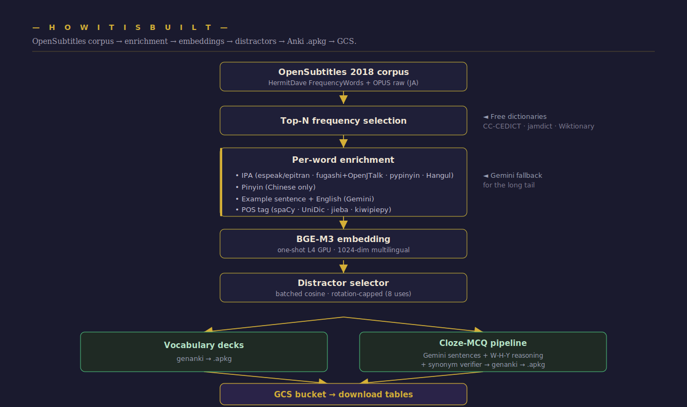](docs/pipeline.svg)

<sub>Click the diagram to open it full-size and zoom in.</sub>

See:
- [`docs/architecture.md`](docs/architecture.md) — full pipeline
- [`docs/distractor-design.md`](docs/distractor-design.md) — the 2/2/1 recipe + rotation math
- [`docs/ja-unidic-rebuild.md`](docs/ja-unidic-rebuild.md) — why and how we rebuilt the Japanese vocab pool
- [`docs/cloze-mcq-design.md`](docs/cloze-mcq-design.md) — cloze-MCQ card format + reasoning block

---

## Quality assurance

Three independent audits run on every release:

1. **Source-data audit** — for every card: answer ∈ options, 4 distinct options, no empty fields, answer present in sentence, blank marker present, English present, Explanation present.
2. **APKG file audit** — extracts the sqlite under each .apkg; verifies field count, no answer leak on the front, the correct option marked on the back.
3. **Randomization audit** — verifies the correct answer is uniformly distributed across A/B/C/D positions (within statistical expectation), no positional bias.

Latest release (May 2026): **48,857 cloze-MCQ cards, 0 issues, χ² < 12 on every deck.**

---

## Attribution & sources

This project stands on the shoulders of:

- **OpenSubtitles 2018** (via [OPUS](http://opus.nlpl.eu/OpenSubtitles-v2018.php) and [HermitDave/FrequencyWords](https://github.com/hermitdave/FrequencyWords)) — raw subtitle corpora and frequency lists. Licensed for academic and research use.
- **[BAAI/bge-m3](https://huggingface.co/BAAI/bge-m3)** — multilingual embedding model (MIT license).
- **[Google Gemini](https://ai.google.dev/) (via OpenRouter)** — example-sentence generation, definition fallback, reasoning generation, and synonym verification.
- **Tokenizers / lemmatizers:**
  - **[fugashi](https://github.com/polm/fugashi)** + **[unidic-lite](https://github.com/polm/unidic-lite)** for Japanese (GPL/MIT)
  - **[jieba](https://github.com/fxsjy/jieba)** for Chinese (MIT)
  - **[spaCy](https://spacy.io/) `es_core_news_sm`** for Spanish (MIT)
  - **[kiwipiepy](https://github.com/bab2min/kiwipiepy)** for Korean (LGPL)
  - **[simplemma](https://github.com/adbar/simplemma)** for French + Spanish lemmatization (MIT)
- **CEFR proficiency lists** (level overlay): **ELELex/CEFRLex** (es), **HSK 3.0** (zh),
  **JLPT** (ja), **NIKL 국제통용** (ko), **[FLELex/CEFRLex](https://cental.uclouvain.be/cefrlex/)** (fr) — CEFRLex sets CC BY-NC-SA, used for personal/educational study.
- **Dictionaries** for free-tier gloss lookup:
  - **[CC-CEDICT](https://www.mdbg.net/chinese/dictionary?page=cc-cedict)** (CC-BY-SA 4.0) for Chinese
  - **[jamdict](https://github.com/neocl/jamdict)** wrapping JMdict (Creative Commons BY-SA)
  - **[Wiktionary](https://www.wiktionary.org/)** REST + wikitext (CC-BY-SA)
- **IPA generation:**
  - **[espeak-ng](https://github.com/espeak-ng/espeak-ng)** + **[epitran](https://github.com/dmort27/epitran)** for Spanish (`spa-Latn`) and French (`fra-Latn`)
  - **fugashi + [OpenJTalk](http://open-jtalk.sourceforge.net/)** for Japanese
  - **[pypinyin](https://github.com/mozillazg/python-pinyin) + [pinyin-to-ipa](https://github.com/stefanstaplerstudio/pinyin-to-ipa)** for Chinese
  - Rule-based Hangul-to-IPA for Korean
- **[genanki](https://github.com/kerrickstaley/genanki)** — `.apkg` packaging (MIT).

All third-party libraries used in their original form, no modifications.

---

## License

MIT — see [LICENSE](LICENSE).

The included frequency lists (`*/words/*.txt`) are derived from OpenSubtitles 2018 via HermitDave/FrequencyWords and are redistributed under the spirit of that project's terms. If you build on these decks, please credit OpenSubtitles 2018 and HermitDave/FrequencyWords.
